# BOOK II - Ascension

This is the evolution of our relationship during our time apart. Here there are some of our messages exchanged through Facebook together with some of my inner processes along this period.

I never send it to you. Until now.

## Preamble {-}

I was raising downwards. 

You were gestating inside my mind.

A sheep in lion’s clothing venturing into the den of a lion in sheep’s clothing. 

## Silence (2019-08-05 to 2019-09-07)

### The letter (2019-08-05 to 2019-08-13)
 
I was in Brussels. I wasn’t worrying much about you, since I knew you would get away of pretty much any situation, but I was curious about what had happened.

<div style="text-align: right"> --- *How was the night?* </div>

--- *The night was great.*

*How was your travel?*

<div style="text-align: right"> --- *Sleeping a lot, like what I am doing today.*

*Planning to write something to you soon.*

*How the night developed?* 

*Anecdote?* </div>

--- *The kind guy found me and brought me to his place, woke up Maritrini, she was quite unhappy. *

*The night developed good.* `r emo::ji("grin")`

*Right after you left, I got high.*

*Ate a vegetarian tortilla in the morning.*

*Got some insightful thoughts on detachment of one’s own feelings.*

I didn’t fully get what you meant by “kind guy” or the rest of the anecdote until three months later, when, considering the new situation, by chance I asked the “kind guy” about you. Anyways, I was pleased you kept communicating and being honest with me.

<div style="text-align: right">

--- *Wonderful. I have trust on you and your resources.* 

*You won't fall from the tree; you'll be okay surviving one random night on Strasbourg.* 
`r emo::ji("slightly_smiling_face")` 


*Remember that you have my help (no matter it's quality) if you feel low. I'll write to put some of my thoughts in order and share them with you (don't expect the most elaborated text...).*

*I send you some love. * `r emo::ji("heart")` 

</div>

--- `r emo::ji("smiling_face_with_3_hearts")` `r emo::ji("kissing_heart")`

That same night I texted you.

```{r nota, fig.margin = TRUE, out.width = "25%", fig.align='right', echo=FALSE}
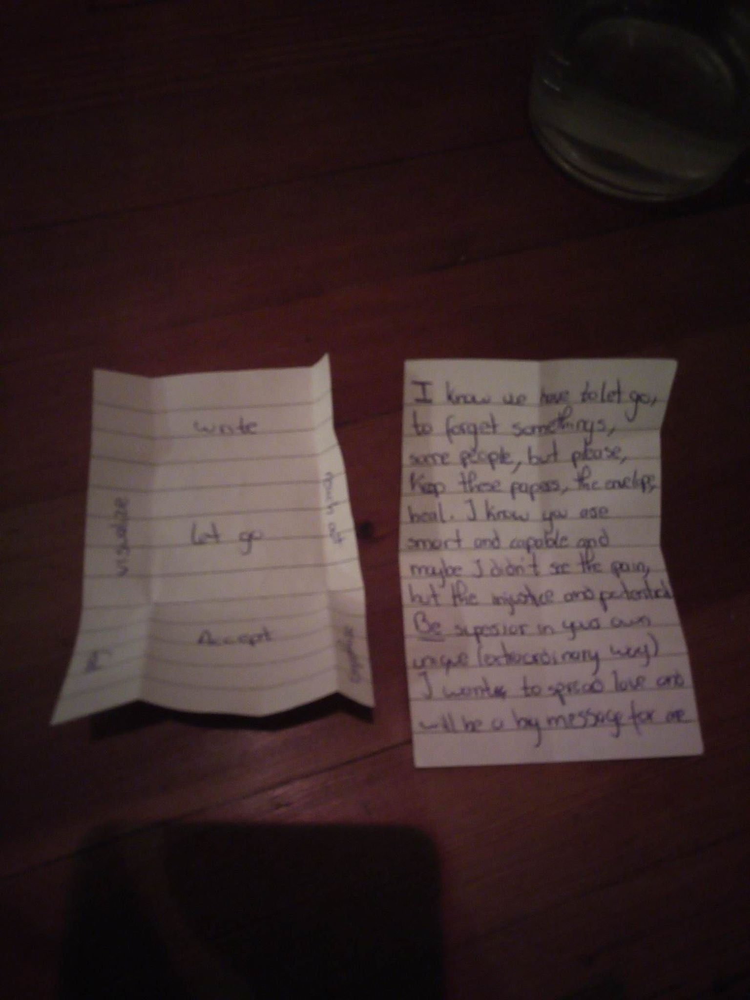
```


<div style="text-align: right">

--- *This one is yours?* 

*Also, share your pics on the album, please*

*The more personal ones, you can share them by email or Dropbox/whatever*

*Thanks!!!*

</div>


I kept on writing your letter. The next day (2019-08-06) I messaged you:

<div style="text-align: right">

--- *I hope you have some free time to read my thoughts* 

*Your email address?*

*The more personal ones, you can share them by email or Dropbox/whatever*

*Thanks!!!*

</div>

You wrote your email address. 

--- *The notes are not mine, I believe those are from Ines*

*I will manage the pictures and everything else in few days, I need some sleep* `r emo::ji("grinning")`

And the next day (2019-08-07):

<div style="text-align: right">

--- *I am pretty done with the writing.* 

*I don't know if you are planning to write or share your writing with me.*

*In case you do, I wouldn't like to interfere your memory and interpretation of the experience with my words and thoughts*

*In case you don’t plane to write and share anything with me, I can send you my text*

</div>

--- *I would like to read it, I have my notes, don’t worry* `r emo::ji("smiling_face_with_smiling_eyes")`

I was advancing with the text. It was long, but worthwhile (2019-08-11)

<div style="text-align: right">
--- *Almost finished*  `r emo::ji("muscle")` `r emo::ji("muscle")` `r emo::ji("muscle")`

*40 pages…*

*Read them slowly.*
</div>

--- *Oh wow*

<div style="text-align: right">
--- *Also, I'm thinking about visiting Estonia.* 

*It could be cool to see your face on cinema. But don't feel obliged. *

*If you don't want my visit, let me know. *

*And in case of going, it could be nice to stay at your place (Tallinn or otherwise)*

```{r endtext, fig.margin = TRUE, out.width = "25%", fig.align='right', echo=FALSE}
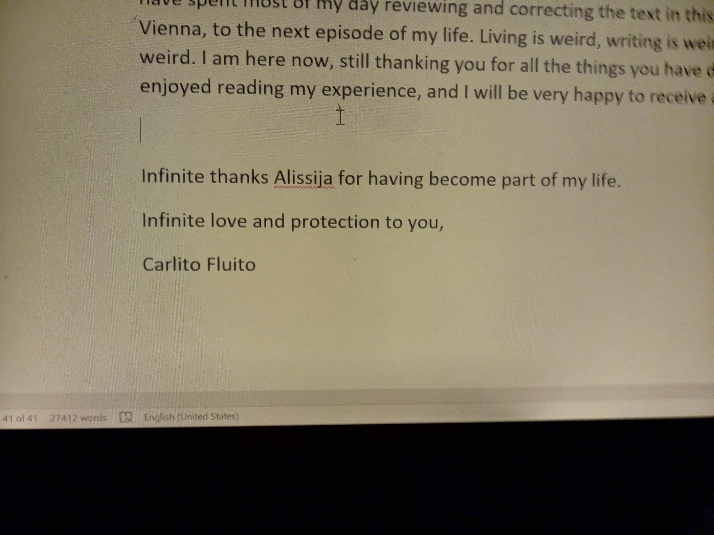
```
*27.500 words*

*Voilà, it's on your mail*

*Enjoy it*

</div>

Two days of silence. It was 2019-08-13. I wasn’t worrying much. I was in Vienna with a friend. I had sent you forty pages of letter to read. That take time to answer. You made an appearance. 

--- *I’ve read 2 chapters and wow how little u know/understand/understood me.. that’s so interesting. I decided to read one chapter a day to lengthen the joy of sweet memories* 
`r emo::ji("smiley")`


```{r cock, fig.margin = TRUE, out.width = "25%", fig.align='left', echo=FALSE}
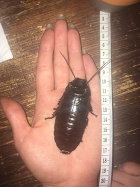
```

--- *I think I’d be happy to see you here, I won’t be able to host you tho in Tallinn cuz I’m giving the room away in the end of August and I don’t know how busy I’ll be with all the school and movie shit so I can’t be sure how much time I could chill with you but if u are coming anyways I’ll be happy to see you*

You comment about my lack of understanding hurt and confused me a bit. Anyways, you seemed happy with the letter. That was enough for me.

<div style="text-align: right">
--- *It will help understanding you, if you share your notes/ thoughts* 
`r emo::ji("slightly_smiling_face")`

*About going, it can be helpful to know your plans and visit when you are more free*

</div>

Then, silence.


### Writing letters around Europe (2019-08-14 to 2019-09-03)

My days were busy. I was satisfied because I had been able to finish the letter. I was enjoying myself in Vienna with my friend. Well, kinda. Actually, I was continuously comparing how intense and alive I have felt being with you; how smart, wise and knowledgeable you were; how much you have challenged me; and how little of that my friend was giving to me. After spending the day with my friend, I wanted to do something that inspired me intellectually. I needed to write out and clear up my mind. I wanted to write you, but a second letter before the last one would have been way too much. Since I didn't know who to write, I felt like writing J., a girl I had met at a party at the beginning of the summer and whom I had spent an evening in a park few days ago, getting to know each other, and eventually kissing on the grass.

However, after your mention of "How little I had understood you". I was pretty sure I wasn't going to send her the letter. At least, not in the near future.

#### Letter to J. (2019-08-14) {-}

00.01 (Just for the coincidences)

Hello J.,

You may not read this until I publish it. Maybe you read it when I send it to you. Or maybe you never read it. In any case, I want to write it and that's why I do it.

I was thinking today about the idea of writing and how when I share my experience of an event or situation to someone else, they have a huge advantage over me. I automatically become vulnerable because I am giving full access to my mind to someone else. I realize this soon (this morning actually) when I shared how it had been my 10 days together with a friend and she answered me that she was wowed at how little I had understood her. Well, that is the thing. I haven’t been in anyone else’s mind or head in my life other than mine. Thus, I can only live and experience life from my perspective and based on my experience. 

On the other hand, writing is this amazing tool that allows us to go into other people’s mind, at least the part that they are willing to share with us, and discover how other people think and experience the world. That is the huge beauty of reading. Reading is, after all, the ultimate enactment of voyeurism. To get into someone’s head. And, it is interesting how the writer exposes itself to an endless number of voyeurs. 

However, I was pondering a reversed thought that I had some time ago about how writing is ultimately a tool to get inside other’s people minds. Writing, and being read, is to get into the deepest intimacy of the people that read. It is even worse, it is becoming part of them, part of their mind, part of their reality, part of their experience of life. I remember I saw [a video](https://www.youtube.com/watch?v=-C8cD_uYKK8) that explained that the advantage of reading authors like Proust or Joyce was that they were teaching how to observe reality from new perspectives, like if we were using Proust lenses, or Joyce lenses. Thus, the exchange seems to me somehow valuable, somehow worthwhile. The author is fully aware of its vulnerability by exposing itself to the reader, but the readers, many times are unaware of how the author is getting into their minds, into their beings. 

I also like the comment made by Peterson quoting Jung: 

> “*People don’t have ideas. Ideas have people.*” 

Therefore, when a writer is consciously and willingly putting ideas into people, he is possessing part of the people that dare to read them. He is entering, inhabiting, and incubating inside people’s existence and consciousness. That is the danger of reading, to let other people entering your mind; and thus, the power of writing, to become part of people’s mind. It results pretty curious to me this bi-directional transaction, this exchange. The curious voyeurism in exchange of the vulnerability of your consciousness. It makes me question whether it is worthwhile the sacrifice of one’s mind, and in case it is, when and whit whom it is worth the sacrifice. Probably, when writing was invented, with the mere purpose of counting and keeping track of grain and goods, people weren’t realizing the huge psychological weapon that they were creating. 

Playing a bit spiritual and mystic, I assume that all this problem of which ideas are getting in which mind comes with the attachment to the ego and the self that is so prevalent in western culture. Recently, speaking with the same friend that mentioned her surprise at realizing that I had understood so little about her, she mentioned that a conversation or a walk could change the way I was. I told her that I wasn’t really afraid of changing who I was and that this was actually a good thing. During my Vipassana experience, I got in touch with something that can be called detachment from the self, or selfless state. It didn’t feel really good at that moment, and I got scared. I opened my eyes and came back to my senses, to the daily reality. Actually, it felt pretty scary to abandon any idea I had about “Carlos”, about myself. At that moment, it felt as if “Carlos” was going to disappear forever to give way to something else that I completely unknew. Although I couldn’t do it at that moment, since then, I have grown a much healthier relationship with my ego, or that is what I like to think. In the example of the conversation with my friend, I told her that I was always up to update my current version of myself to a new one, to something better, to something that is working and behaving in better way within this world. It requires a big dose of courage, but more than courage, I would consider it as detachment. It requires a huge dose of detachment.

The other thing I have noticed is that sometimes is difficult to keep track of my changes and how quickly I am switching previous versions of myself. For example, it is a bit difficult to remember which version of myself you met at the party and compare it with the version of myself that I am today. You know, I like to think that the more versions of myself, the better. Especially considering that you liked the version of myself that you met the other day. I would like to imagine that the self is an accumulative process, instead of a renewable one. We can already agree that it is a fluid process, that the self is not fixed; but I am thinking that is actually a renewable one. Although I am not completely sure. It is clear that we are not the selves that we were used to be when we were kids, but I am not sure whether the self that we were when we were kids is still hidden somewhere in a corner of our minds. I mean, it probably is, which would mean that the self is accumulative, and although it has renewed, it hasn’t completely erased previous versions of itself. 

Anyway, don’t take myself to seriously, after all, it is 00.33 and synchronicities is a concept that neither me, nor science has completely understood. 

The only thing I know is that I would love to spend more time with you, and I would love to go to concerts with you. Today, I saw one in the city hall of Vienna of a couple of comedians/musicians that I would love to re-watch with you, so you can explain me many of the musical references that I didn’t understand, which are most of them. Also, I imagine myself reading at your place while you “study” with the cello, which for me would be like being in a concert while I am reading. Also, I am imagining myself developing my dance performance next to your musical improvisation, which would be extremely interesting for me. And while imagining this things, I keep on reminding myself that we have met each other only two times, and although, we have like each other in both of them, or at least our laughs reflected so, we have just kissed in one, the one we were less drunk. Thus, I cannot send you this letter today because you could interpret my words, dreams, and imagination as neediness, and there are few things as unattractive as neediness. 

It is this sad, but this is the game we have to play in this society at this point of history. The game of disguising love, so it is not confused with neediness. Or maybe, who knows, I am needy. I am needy of a person that puts some art and beauty in my life. V. left. A., who knows if she is gone. And you, you play the cello. 

Lucky me, I can write and talk with you today, and lucky me that I can control and choose whether you read it or not, whether you hear me or not. Lucky me that I can put my thoughts outside of my mind, and maybe, and probably inside of yours, but simply, not tonight. 

Thanks for reading, whenever you are doing it, and whoever you are. 

Have a good night, with a few of my thoughts in your mind, and a part of myself in yours.

That happens when you practice voyeurism with the person you shouldn’t. 

----------

The second day in Vienna, during the Free Walking Tour, I started to have negative thoughts and ideas. I felt disconnected from the rest of the tourist. I felt disconnected with the people around the city. I felt disconnected with the moment. I didn’t want to be there, I didn’t want to do what I was doing. I felt stupid there, like wasting my time. I didn’t like people… Actually, the most interesting things that happened was to observe a confused bee that was struggling to move around the tourist. I was wishing none of them would step on it, since it could barely fly and she was moving clumsily at our ankles level. Little by little, I was able to move it towards a tree that was next to St. Stephen Cathedral. Even that tree looked sad and miserable, locked around concrete, next to a huge pile of stones.

I took notes on my phone about the feelings I was having, thinking that I wanted to send them to you. You that were so verse in these dark parts of existence, in these obscure wells of negativity. You could help me explore those depths that I had repressed for so long. You had indeed dig enough to bring some of these ideas to the surface. I was unlocking my shadow, thanks to the time spent together. That was something new in me. Something that I had to work on, and who was better than you to work on it? But I didn’t want to make you feel utilized by me. So I had to think about someone else. Who would like to receive the darkest part of my being? Who other than you, that was so experienced on psychological suffering?

I thought about In., from the exchange. She has been the girl that had made me cry with her farewell. I am a person with difficulties for crying, for releasing my emotions through my tears, but it has been deeply liberating to cry at her room. She was a person wise and comprehensive enough to receive my pain. I kept on taking notes during the next days, and later on, when I found time, after my trip and once in Brussels, I wrote the letter. 

The trip continued as planned. I visited Ljubljana (Slovenia), and then, Trieste (Croatia). In both countries I met my friends, wonderful beings all of them, and also a new person came to my life. They all showed me how much I still have to learn, and how much I was already ready to give. I speak with them about you. They made some comments, but they trust on me, and my ability to take decision.I kept myself busy spending time with them while you were reading my text. Hopefully, you would answer with your words at some point. I wasn’t expecting a long letter like mine since I was already used to it. Many of my past letters to other friends have been left unanswered. Specially the long ones. But anyways, I was eager to hear from you, to know your feedback.

I talked with K., your best friend, a few days later (2019-08-17). I asked her for the pictures of the exchange. Two days later (2019-08-19) just when I arrived back to Brussels from Croatia, I found K.’s message. Without any warm up, she hit back.

--- *What is the meaning of life?*

<div style="text-align: right">

--- *A bit of a difficult question for FB chat*

*Why do you ask?*

*Btw, I’m fan of writing letters, if you write me one with the question and context, I can write my answer*

</div>


After 3 days of K.’s silence (2019-08-22), I sent her the link of my “Meaning of life” [video from YouTube](https://www.youtube.com/watch?v=BTHVNQRvm_M&feature=youtu.be&fbclid=IwAR0XEvzxj99rYsp0bIKc-RylJ_4j_Xu97bwAdT-Gk7utPauJsrLozfE_xaE). She just reacted to the message with a thumb up.

<div style="text-align: right">

--- *How are your existential questions going?*

</div>

--- *Perfect*

She wasn’t specially talkative.

<div style="text-align: right">

--- *Great*

*Are you posting the pictures in the folder?*

</div>

K. became silent as well. She wasn’t uploading the pictures to the folder either. I wanted to see ourselves kissing during the last day. I wanted to refresh my memory with the images of the exchange. I wanted to conserve the pictures for the future. But it wasn’t happening. 

I was in Brussels, feeling lonely from time to time, like always. Anyways, I didn’t want to show myself vulnerable, or to needy or demanding for you. I was waiting for your answer, which wasn’t arriving. However, nine days after your last message (2019-08-22), I thought I had been waiting enough and I decided to text you. 

<div style="text-align: right">

--- *How are you doing?*

</div>

But nothing happened.

One day later, I decided to take a look to the notes I had collected in Vienna, and I wrote a letter out of them. 

#### Letter to In. (2019-08-23) {-}
 
18.38
 
Brussels, Mortimer is drinking
 
Hello In.,
 
I don’t like human beings.
 
A bit of a disclaimer first. I use my bad days to write to other people, like you, but I am quite aware that I am mostly writing to myself.
 
Hello Carlos,
 
However, you are my reader. Or at least, the person that I am supposedly writing this letter to. Thus, at least, the honor of writing your name at the top, next to the date, the time, and the place where I am in.
 
The second disclaimer is not to take very seriously what I am writing. I am also pretty aware that emotional states are transitory, and I have gotten pretty good with time at not having more than two bad days in a row, and most of the time, these days reflect things that I have or have not done that impact directly or indirectly to my wellbeing. For example, I have showered the last four days with warm water; I am following a new diet that may be affecting my mood as well. I am trying the 80/10/10 raw vegan diet based mostly on eating large amounts of fruits. The main reason is going minimalistic in the kitchen/life and increasing the environmental sustainability of my existence, although I am not fully convinced of the second. Besides, I keep on procrastinating a pile of things that should be done or that I should be doing; and I have been avoidant of some of my well-being practices, like exercising, meditation, listening to hypnosis, following some online courses and others. In the negative aspects, I am sleeping more than usual, partly because of the diet; and last night I slept on the bed, instead of on the floor, which I have to admit that it has been indeed beneficial (at least, just for one night). Also, today my landlord kind of threatened to expel me from the place where I am living because I haven’t arranged the patio since I arrived on Tuesday. Today is Friday, but the deadheading of the daffodils should be done two to three times per week. We are different people and each of us has their own peculiarities… ^[Apart from dog-sitting, in order to live at my studio, I had to do some other house errands and gardening tasks.]
 
As you can notice, I am not following a very typical life. I am not sure either what is the right thing to do. I was feeling lonely on Wednesday evening, but I was too tired to try anything social. Yesterday, Thursday, I met a friend and we went to Luxembourg square, a place for public drinking. I get easily bored and I find the people there quite non-inspirational. Today, I just come from meeting a friend that is vegetarian but said that my attempt at fruitarianism is extremism. She said, “*Don’t be a Nazi.*” Well, Nazis killed people, and I am eating fruits partially to avoid killing trees. I think that there is a small difference. I think that extremism is quite the opposite, which is the meat and dairy industry. But let’s avoid such an easy topic. Although, I was listening to the debate [“*Animals should be off the menu*”](https://www.youtube.com/watch?v=mNED7GJLY7I) today. The 10 minutes argumentation of Phillip Wollen is quite a phenomenon on social media, and if you haven’t watched it, well, [you may](https://www.youtube.com/watch?v=uQCe4qEexjc).
 
The turning point during the evening was when I saw a dog whining to another dog while he was pulling from the leash to try to get to the other dog. At that moment, the thought came to my mind “I don’t like human beings. Fucking primates.” That reminded me of all the notes I took while walking around Vienna a bit more than a week ago, and how I already thought about writing to you to share this darker part of my being with someone as socially intelligent as you are. Also, now, while writing, the episode of Nietzsche protecting a horse that was being beaten came to my mind. A genius sent to an asylum for a public demonstration of compassion. You see, we are supposedly getting better but environmental, and human rights activists are still arrested by the police. We are getting there.
 
Let me take my notes from Vienna.
 
<center>**NOTES FROM VIENNA**</center>
 
**I have a lot of hate inside**
 
There in Vienna, the realization was a bit deeper and darker. Here, I opened the letter saying that I don’t like human beings, but there I wrote that I hate them.
 
Actually, I realized that I have a lot of hate inside. As a wannabe, spiritual leader, recognizing and assuming this may seem a contradiction, but to me, it just indicates to me that I am on the right path of self-discovery to healing and towards a future more focused reorientation of my efforts toward others. So, yes, I have a lot of hate inside.
 
It was there, accessible and controlling, back in the days of 2014, where I was living in Leuven (Belgium). I cannot say this often, but this part of my life is already public and published, you can [check it on the website](https://carlitofluito.github.io/letters2013_14/). Thanks to the invaluable advice of my former philosophy teacher, my master and mentor throughout the years, I was able to move away from existentialism, Bukowski, and the heavy thoughts that were infecting my mind. I oriented my attention into the optimism of Russel, Mozart, and by chances of life, the Tao Te Ching. Anyways, I am not there now, not even close. I am on a much more stable and fulfilling path, knowing where I am going (kind of), and keeping the progress. I assume that it has been these four days of accumulated procrastination what is affecting me.
 
**Is it normal to empathize more with animals than with people?**
 
There in Vienna, I was observing a confused bee, walking randomly on the street, trying to find its way. It was actually during the stop at Stephansplatz, where the guide, Wolfgang, was speaking about the church when I saw that poor bee. There in the square, I had given my water and some figs and dates to an old woman and her husband the day before. How could I have not? I was surprised that under the sun and the number of people on the square they were so grateful to me for doing it, and how no one else had collected a tiny bit of their empathy and compassion to help some fellow sapiens. As you see, this is one of my problems, I focus on seeing others’ faults instead of seeing what I do right. But I keep on doing it right anyway. And hopefully, they will stop doing it wrong. Right and wrong… Those things that only moralizers like me dare to say, but when speaking about compassion, for a weaker and more vulnerable sapiens, they are difficult to deny.
 
I was worrying for the bee because it seemed to me that anyone could step on it at any moment, and I wouldn’t like to witness that. Thus, as soon as Wolfgang stopped talking and moved towards the next stop, I took the bee on my phone and put it under a tree where who knows what its future would be.
 
The fundamental question that I made to myself at that moment was: Is it normal to empathize more with animals than with people?
 
I could answer that question to myself later that week when I saw myself reflected on a vegetarian friend that was complaining about how irresponsible their friends were for not taking care of their own lives. My friend, B., was really angry. He mentioned the case of one of his friends that was lying by telling him that he was making progress with their own master thesis when indeed he was not. Why lying to a friend that is trying to help you? Why lying to yourself so openly? I told B. to be compassionate, to be empathetic, to understand the development of each human being, to be patient. Those things that I preach and learn during the exchange. (Actually, you don’t know how my story developed on the exchange… You’d love to read about it once it is published &#128521;).
 
I told B. that the construct of free-will in sapiens makes us, fellow sapiens, to consider individuals responsible for their successes and their disgraces, responsible for the outcome of their actions. That is why, from my point of view, it is way easier to empathize with a poor bee, or all the victims of the meat industry holocaust, than with a sapiens that doesn’t study for the exam, or that keeps on consuming meat while being aware of its environmental and suffering impacts.
 
Awareness, like reason, like consciousness, like freedom, as Fromm defended, brings consequences, brings burdens, brings responsibility. If a sapiens, who is supposedly aware of the impact of its actions wants to remain coherent of its behavior, it better behaves properly, because if not, it will be 1) immoral, and 2) object to the reprimands of its fellow sapiens.
 
(Speaking about sapiens calling us sapiens, and using the “it” pronoun is actually helping me to make my point a bit clear while reminding gender neutrality because, you know, 2019…)
 
The thing is, if we take out free-will, and become more tolerant and patient of other’s sapiens development, we may reduce ourselves to unconscious animals that are merely led by circumstances, genes, and impulses. I was there once in the past (also in Leuven 2014) realizing how liberating was to call myself a product of all my previous experiences, and taking out all the burdens of my past and present by claiming that I was nothing but a product of what I have experienced and lived. But, the downside of this view is that many people would take it as paternalizing, and with tones of superiority (and you know the general opinion about patriarchy nowadays, 2019, you know…).
 
I wouldn’t mind being more tolerant, patient, empathetic, and even helpful with sapiens as long as they would assume that they are not more than a dog that is learning a trick and it is taking a bit more time to understand it than a normal dog. But I fear that the general opinion about this comment would materialize in an infuriated mass offended by my comparison to them with animals. Well, either I treat you as a dog and I express my understanding at your slow development and learning, or you better become aware and conscious of how your actions are affecting other beings’ wellbeing, and you start doing what we both know is right to do. So please, In., help me with this dilemma.
 
Should I empathize with my fellow unaware sapiens like I do with bees, and dogs? Or should I blame them for their lack of responsibility towards the consequences of their actions? Can I do the first without being patronizing and seeming superior? Can I do the second without receiving defensive comments and weak argumentations about free will and how each person is free to do whatever they want? “*I am not forcing you to eat meat. Don’t force me to not eat it.*”
 
**Are anger and hate a manifestation of fear?**
 
The so-common spiritual bi-polarity of fear vs. love also affects me when I think about these things. Supposedly, every action, intention, thought, emotion, reaction can be a sub-product and a manifestation of either love or hate. Well, who knows?  Maybe it’s true. Thus, I was thinking, if anger and hate are not easily identifiable with love, they have to be fear. But it is difficult for me to make the link. Anger can be fear of a certain type of injustice applied in oneself, and then, seeing one’s existence threaten, provoke the fear response that could manifest with anger. For example, if I get angry at sapiens not realizing that the life of a being, whatever its species and quality, shouldn’t be killed by hedonistic purposes, maybe, deeper in my being, I am afraid that these same sapiens could turn violently on me as a source of satisfying their hedonistic purposes with a detrimental effect on my wellbeing, or even my life.
 
However, hate is a bit deeper and obscure. Hate is close to disgust; it’s close to avoidance. But at the same time, it can be close to a violent approach. I remember that quote of Hitler in his “*Mein Kampf*”:
 
> “I can fight only for something that I love. I can love only what I respect. And in order to respect a thing, I must at least have some knowledge of it.*”
 
Therefore, hate, as opposed to love, is a lack of interest, lack of knowledge, lack of respect. That is why it is easier to hate things that we don’t know, things we prefer to be distanced with. Feelings like *universal connection*, the unifying quality of a spiritual experience, are so linked with love and the dissipation of fear and anger. When we start seeing all as once, we stop hating, we stop being angry, we stop fear. Anyway, in my case, I may hate humans because, as it happens with anger, I may fear that they become against me as individual as it has happened in the past so many times… Niemoöller stated this in his famous “*First they came…*”
 
Also, one quote I wrote after my incident with the Belgian facilitator, Et., was:
 
> “*I wish I could be extremely intolerant with violence, but violent people don’t tolerate this type of extremism.*”
 
So yes, as it seems, hate is another manifestation of fear. My deeply and rooted fear of not only my end as an individual, the fear of death that is so connected with the experience of being alive and which I am still attached to but also the disappearance of sapiens as a species and all those that may die with us, besides all the suffering generated on the process. I almost write “the disappearance of life on earth”, the only known place on the universe with life until date, but I easily remember that the Earth will hear from us as we heal from a bad flu. The conditions and characteristics of the Earth and the temporal dimensions of this universe make human existence and human impact shrink when considering astronomical measures. Thus, I am not scared of the disappearance of life on the planet, but I am pretty worried about the suffering that we can cause in our species and the rest forms of sentient life.
 
So yes, some fear is present over there.
 
**I see life as a competition.**
 
Another really intelligent comment you made that night we spent at the porch of the hostel was that instead of making my interactions with people as a zero-sum game, as a competition, I could reframe them as cooperation, as a non-zero-sum game.
 
For example, today a friend sent an initiative about posting a picture of your pet tagging Royal Canine and Scouts Spain to promote donations towards animals in refugees. Well, I asked him if he was vegan or not. He mentioned that he consumes local animal products. Before blaming, I congratulated him for his efforts but it was somehow unavoidable mentioning that he is only financing the killing of “local animals”, which is not that bad, but…
 
Later on, during the day, I realized that I could reframe the situation as if we were together fighting for the same cause. I just have to accept that there are some fighters that are better than others (although since I cannot say “better”, more efficient, more impactful, more quarrelsome). I wrote it some years ago, “

> *We are fighting the war of peace*”

So the best warriors are those that make less harm. But as you can see in my metaphor, it is all a competition. Not only a competition like the two sides of the battle but a competition between warriors from the same side to check who is the best. Maybe, I should start reframing the competition in an “us vs. them”, and this way, at least, I would reduce the competition I have towards the people on my own side. And who knows if, at the end, I will realize that “we are all on the same side and that we are just doing our best living the life we have.”
 
But yes, I guess I should repeat this as a mantra every day. (I just add it to the daily affirmations.)
 
I will work on it.
 
**Am I selfish?**
 
Well, I think so. Indeed, yesterday (2019-08-23, now is 2019-08-24; 10.13) I was talking with a friend and I realized that I am fucking selfish. She was telling me how the last exchange where she participated has changed her life and some of the lessons that she has learned from it. At some point, I had the impulse to start talking about my experience, what I have learned and how I have growth. However, thanks to having written to you the idea about being compassionate with superiority, I remembered that she is younger than me (21, I think), and I let her talk as much as she wanted. I even started asking “*Something else?*” when she stopped. I think it was really good for her to feel listened and not judged about her process of development. I remember how, when I was at her stage of development, years ago, I used to have a friend, Laura, that was eight years older than me. Laura used to give me advice about life and love, but somehow, she destroyed part of what I was discovering, and made me doubt about the truths I was encountering on my way. L. is still today one of those ambiguous figures of my past that I haven’t fully interiorized, forgave, or understood. I didn’t want to be my friend’s “L.”, so I remained silent and non-judgmental. However, since we went to my place to sleep, my lovely ironical and critical Carlos took control of the situation and started making all types of comments, from calling black people: “*black. Oh no, sorry! Human beings with high levels of melatonin in their skin*”; to speak about sex and virginity from a “*phallocentric perspective*”, because, you know, 2019…
 
I ended up mentioning things like “*If you see yourself too cute in the mirror, no worries, it’s because it’s my mirror. That is why I am such a conceited guy.” Followed by “*Magic Mirror in my hand, who is the fairest in the land?*”^[“*Espejito espejito, ¿Quién es la más guapa del reino?”* in its spanish version] because, you know, Walt Disney did its job brainwashing my generation selecting which values are considered feminine and how girls should be after them. Since I couldn’t stop, I was mentioning my keenness to eat sushi from the trash and how I would have loved to be a fish living in the ocean to be fished, killed, processed, packaged, transported, cooked, packaged again, and, eventually, thrown in a bag to the container. Well, at least, I took it. If M., my friend, sends me the picture, I will forward it to you, just so you can update what eating from the trash means.

```{r sushi, fig.margin = TRUE, out.width = "50%", fig.align='center', echo=FALSE}
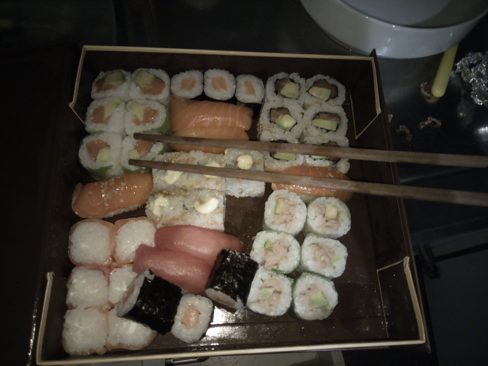
```
 
So, yes, after that, I even had to comment how the dog thanks to whom I am living in this studio is likely living better than more than 50% of the sapiens of this planet. He has four meals a day; a private house for himself, and a shared one; two sapiens taking care of him, one of them, me, has the denomination of “dog-sitter”, the other one is the “owner”. Since he is already 16, way beyond average life expectancy of fox terriers, the visits to the vet have increased lately to, I am guessing, twice a month; thus, a private doctor to do check-ins every two weeks. Besides, he is taking four different pills (that is the reason he is eating so many times) to control his arrhythmias, and intestinal problems (his diet switched to a low-fat type of croquettes about six months ago). And well, if loneliness is a problem for the lucky European elderly, not for him, since that is the main reason I am here. He spends most of the day as an alive dog of his age would do, sleeping, walking up and down the house, and smelling stuff around.
 
I don’t want to bring numbers to the table about undernourished and famished sapiens, or about climate change refugees, or about wars refugees and death tolls, or about currency inequality, or about the highest one percent having more than the lowest fifty per cent, or about social care system in the US, or about access to drinkable water, or about, or about, or about… You know, 2019.
 
Maria asked me: “

--- *Do you think that this dog would still be alive if he wouldn’t be taking the pills?*

--- *Absolutely not. This dog is a miracle of western science.*

--- *And don’t you think it is a bit unfair to keep him alive?”

--- *Well, I am no one to judge. I am just describing the situation. I let judgments for other people.*

Future, if any, will judge us.
 
M. went to the bathroom and I kept on thinking about the planet. Maybe in the future people like Bolsonaro have to pay for what he is doing to the Amazonas. I like terms like “*Crimes against humanity*”. I think they are very suitable in these situations. Maybe it is me, the one that ends up paying in the short term with social rejection, as is happening, for bringing moral issues to the conversation table. “*Please, let us eat at peace.*” Yes, peace. Peace is a wonderful value as well.

I was reluctant this morning to kill the mosquito that woke us up. You know, let it live, let it breath.
 
M. wanted to have sex. I didn’t. I tried to explain to her how to arouse a guy that is not excited. She is young and impatient. She couldn’t listen, understand and accept. She told me that I wasn’t cooperating. I answered:

--- *I am telling you the solution. This is what happens to me with humanity all the time. I tell them the solution. They do what they want. And I just asked them to leave me alone if they don’t want to listen.*”
 
Because I was starting to feel a bit guilty like every time I was directly increasing the suffering of another being, I told her:
 
--- *This is how life works. Many ignorants vote an asshole that sells a piece of the planet to a bunch of heartless in exchange for some paper that is used to buy things.^[English doesn't allow making nouns from adjectives. If “ignorants” and “heartless” sounds weird without a following noun for you, add “sapiens” behind the word.] But you have posted a video about it, M.; and that is already more than what I have done.*

I had tears in my eyes when I added this last sentence. Depending on how much she wants to admit, thanks to my influence, or not, she has switched from omnivore to vegan, and moved to a more zero-waste life along the last year we have known each other. When I met her for the first time, in September of 2018, she had liquid soap in the shower. Now, it is solid. It seems to me that the most effective way to influence women in their ecological behavior is through sex. Anyway, she is a great human being doing great things for humankind, and I hope she keeps on doing them. Eventually, I added:
 
--- *Affirmations, M., affirmations. To not forget about it.*

To not forget who you are, and what you are doing. And I repeated to myself the first affirmation of my list: “*I am alive. I am breathing. I love breathing.*”^[If you want to check the whole list, [here it is](https://carlitofluito.github.io/dreams/affirmations.html)]

So, yes, a pretty good-intentioned asshole. That is what I am. If I am selfish or not, I don’t know.
 
Maybe. I like to think of myself as a pretty non-selfish person, but who knows. Maybe I am one of the most.
 
**Guiltiness and suffering**
 
As I have mentioned, when I realize how my behavior, attitudes, emotions, words, and thoughts are increasing the suffering of other beings, I feel guilty. I came up with this idea while being in Vienna.
 
I was with my friend Br., who is also quite young (20) and has some trust difficulties manifested in different degrees of social anxiety. Poor Br. is from Romania, I met her in a Youth Exchange a couple of years ago and she is the one posting on my social media. I met her in Austria with the idea of seeing each other after a long time (more than a year of attempts) and to reinforce her for working with me (I paid for most of the things of the trip). Also, just so I am not avoiding a meaningful part of the story, I am sexually attracted to her: she is cute, blond, young, and well-proportioned (you know, sapiens male brain). We already kissed on the past, and she expressed her erotic intentions towards me at some point. Anyway, along the days we were together, I developed a strong impatience towards her. So many basic things that she didn’t know how to do, or how to apply... I told her from the beginning that I was very impatient, but she kept on complimenting me for my patience with her. I am really sorry for the type of people she has encountered in the past to consider me as patient. That is a good example of how different our inner lives are experienced from what other people are perceiving. Inner suffering, you know.
 
Br. has a certain level of dependence to caffeine. She mentioned that she had low-blood pressure and that coffee was good for her health, especially when she had the period, as it happened in Vienna (do you see it coming already?). The free tour on which we were participating made the break for resting in a hotel, and although I am quite anti-consumerist, Br. decided to take a coffee there. I wasn’t going to moralize more than what I was doing already, so I went to the bar with her just to observe. As a Romanian student, you can quickly imagine how much of an economical impact one coffee in the bar of a hotel of the center of Vienna does. I was paying for the Airbnb and food for both, but not for what I considered expendable expenses. She took her purse and started collecting copper coins. It reminded me so much of my old days that I couldn’t feel anything other than warmth in my chest. I liked so much her initiative of getting rid of all that extra weight that I was very committed to helping her count them. However, she got nervous and self-conscious, and told me to leave her, just to take the two-euro coin and pay with that and some 50 cents. I tried to rationalize with her and tell her that money is money and it doesn’t matter. But her social anxiety started to kick in. She got shaky hands, unstoppable thoughts, and uncontrollable emotions. She kinda got annoyed with me, and I got annoyed with her. I left the hotel, turned to my phone, and laughed and moralized (another vegan discussion) at what my friends around the world were messaging to me.
 
Later on, I felt guilty for having screwed up Br.’s expensive treat. I am so aware of how interfering for the digestive processes is to ingest foods with an activated sympathetic nervous system that when I am willingly annoying someone while they are eating, I am doing it led by pure evil. Thus, I felt guilty a bit afterwards for that incident. Last year, I ended up writing a post to another Romanian girl that was driving me crazy. “[*Unsweetened advice*](https://www.carlitofluitoideas.com/unsweetened-advice/)” in case you are interested. She was driving me crazy, blaming me all the time for her psychological suffering. I was fending off because obviously, she had tons of inner work to do with herself, and from my point of view, she was not only ungrateful, but blaming, and her development was way too slow for my patience and the amount of time that was taking me.
 
One of the first pieces of advice is “*Stop blaming others for your psychological suffering*”. I was very much applying that to keep my conscience clean each time I saw other people suffering for something I have said or done. After all, I am behaving morally right, since they are responsible for their own suffering. However, in Br.’s coffee case, I remember that physiological procedure of cortisol release and its consequences in the stomach walls. And, then, I thought that the barrier between psychological and physical suffering had been trespassed.
 
Can you see the level of assholeness that I have as a psychologist when I start blaming myself for the psychological suffering I create only when I find the physiological links between emotions and thoughts and the physical body?
 
**Is it sexual frustration?**
 
Since I am writing my [“*Unfinished loves*”](https://carlitofluito.github.io/unfinished_loves/), it made me think that part of this anger and hate towards humanity, and some of its members more specifically, that appears from time to time can be all a manifestation of my sexual frustration. This idea appeared to me in Vienna, when due to Br.’s period and menstrual pain combined with her 20 years old innocence, I was left with one of my reasons for taking a 19- hours-bus unfulfilled. The whole trip was pretty good: beautiful city, interesting history, long walks, raw food, open air funny classical music concert, history of art museum, and going up one of the Fair Ferris Wheel^[Blame Google for this translation.] in Prater Park. However, Br.’s company was a bit frustrating. My impatience and lack of compassion towards her period and weakness; my accumulated testosterone; and the continuous instruction about what I considered basic survival, travelling, and life skills topped each other and, although I really tried to control myself, at the end I couldn’t refrain from repeating the word “*Humility*” about ten times once I took her smartphone and found out why she couldn’t have connected to the public wi-fi during those three days in Vienna. That humility that I so manifestly lack is what I find myself preaching to so many other people around.
 
However, my hypotheses about the sexual frustration crumbled when the following days in Ljubiana I noticed that my friend was probably attracted to me; or in Idrija when a gay friend of my friend was explicitly attracted to me; or in Koper when some older and younger women were looking at my dance movements with something more than artistic interest; or considering the condition of my physical body in the mountains of Istria; or the evening together with a Belgian girl here back in Brussels; or the last night with M. When she was almost begging for sex while I observed her pitilessly.

```{r mfeet, fig.margin = TRUE, out.width = "50%", fig.align='right', echo=FALSE}
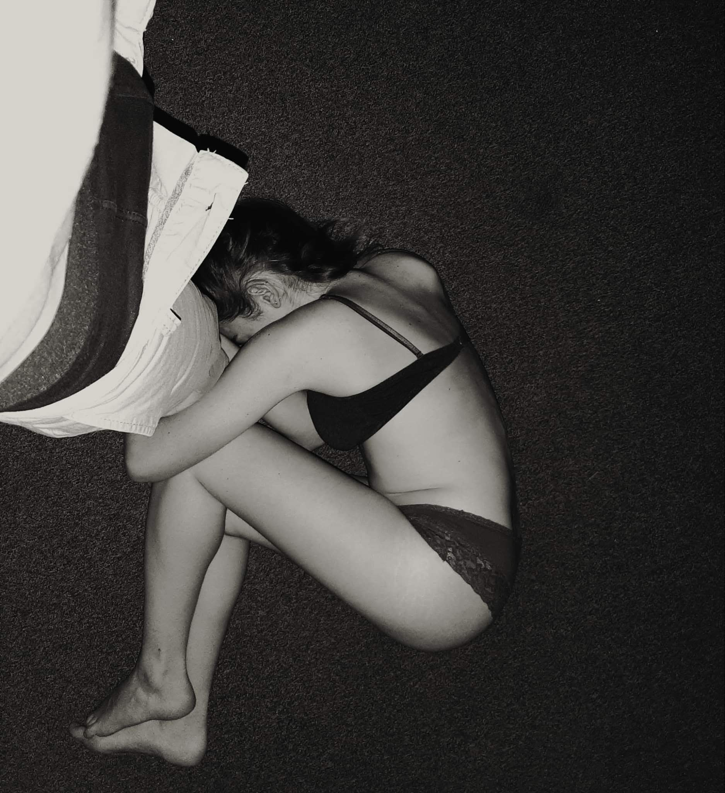
```
 
It doesn’t seem to me sexual frustration as much as “*Connection frustration*”. The gay from Idrija that I just mentioned was actually one of my more surprising connections of the trip. He is a frugivore yoga teacher living in Amsterdam, that, if life and the universe don’t give me unexpected lessons, he has become a friend for the following years. Also, in Croatia, I was visiting a friend with whom I deeply connected, in a very fruitful way. And the universe made a huge guy called Michael Gebetsroither to be seated next to me in part of my bus from Graz to Ljubiana. He really made me realize the infiniteness of my ignorance and how, how much I still have to learn. K. and N. are also wonderful souls to rejoin. Thus, those three days of connection frustration, and maybe sexual frustration as well, in Vienna transformed into beautiful connections around Slovenia and Croatia. Secondary players are N.’s boyfriend J., and B.’s girlfriend M., which are also two wonderful silent souls that I easily connect with.

However, I arrived in Brussels and I came back to this place where it is so difficult to find people that actually inspire me, and that keep my motivation to push myself forward and fulfill my goals and purposes towards humanity. I do what I can, but, I can get tired sometimes as well.
 
This morning, I broke my diet more seriously by eating some cooked sushi from yesterday's trash. This relapse will help me empathize more with all those big people trying and failing in dieting.
 
**Sex and connection**
 
The Google Keep note where I saved these thoughts in Vienna is called “*Questions for A./In.*”. I don’t know who is the unluckiest of you two, since I am already in my 10th page, and it seems that I still have a couple of things more to take out of myself. I chose to send this letter to you to give some breath, space, and “distance” to A. with whom I shared 40 pages narrating my experience in the project and the role she had played on it. Last thing she texted me was something like “[…] *Wow, how little you know/understand/understood me… That’s so interesting.* […]” I guess that apart from my short understanding about her, by now, she would have already discovered many other things about my inner experience of being alive that she was unaware of. Anyway, I told her that she was welcome to write me back, to uncover some of my ignorance towards her, and when I mentioned visiting her in the following months, she didn’t transmit me full conviction. Last thing I messaged was a “*How are you doing?*” on Thursday. Today it is Saturday and there is still silence on the line. No worries. It is not about me, it is about her.

Thus, I prefer to steal some of your time (Thank you very much for this), and write to you instead of her, although she could also be a good source of guidance for some of the problems that I manifest.
 
I was extremely lucky to meet you and A. in the project. When I asked M., my friend about her project, she told me that she had connected with 10 participants out of 50. That is 20%, or 1 out of 5, which is way better than I did. In my case, T. and H. were expelled the second day, with whom I would have connected, and then you left three days later. Thus, I was almost left alone with A., K. from time to time, and the boys in my room to a more superficial level. I am indeed a pretty extrovert and social person, but when it comes to connection, it is commonly difficult to find people that understand me on a deeper level and that can offer me some useful help when I need it. This is partly what your intuition told you when you asked me if I had friends to speak with here in Brussels. Well, now you see.
 
When it comes to friends, let’s say it is somewhat difficult but still easy, because mentioning romantic partners, things become twice as difficult, since 50% of the population are left out. But even worse, considering that my age keeps on growing, I am already 26, and that people tend to establish their lives in monogamous relationships, and that I am kind of picky with the physical appearance as well, chances of finding a fulfilling romantic partner keeps on reducing. However, I can think that a girl with a mindset that attracts me will probably be in similar circumstances, and she will also take care of her physical appearance. Thus, this increases the odds a bit. But who knows, it keeps on being difficult to find the people to connect with.
 
So, we’ll see how A.’s relationships grow, but I stop having expectations about pretty much everything, surrender to life, keep on enjoying the process, and remain optimistic about what the future is bringing. She will come. They will come. We will meet. But yeah, some days get heavier than others.
 
**About how to invest my time.**
 
I used to remember when I was a teenager with less of those passive spiritual skills that I am growing these days (tolerance, patience, silence, surrender, empathy, compassion…), how difficult and annoying it was for me to participate in a conversation of a topic that I didn’t care about. I see myself standing silently listening to some personal bullshit about Joe Johnson having a conflict with John Jowson, and Jey Jamison wanting to spend more time with Jane Jannetson. Really, it was all so purposeless. I grew up with the belief that listening to mediocre people’s lives was a waste of time compared with reading a high-quality book. However, my low threshold for loneliness and my appreciation for excellence trapped me at both endings of the rope, arriving at the point where I am not good at any of them. Thus, in my gloomiest moments, I came up thinking that I am neither a solitary successful artist, nor a famous loved leader, I am somewhat in between, and none of both at the same time. An almost-but-not-really. 
 
Later on, the future and my humility taught me that I could learn something from everyone. I just had to find their field of expertise, I just had to ask the right questions and discover what the passion of that person was, what were their inner motivators and what could I learn from their life experiences. But it took effort, time, and in many occasions, frustrations from both parts, since it seemed that the conversation was leading nowhere. Either they didn’t have any passion (which I wouldn’t like to think as true); or they didn’t want to share it me (maybe avoiding to acknowledge that they were being neglected to their true dreams); or I wasn’t making the right questions to discover their passions (which I kept on trying and trying).
 
In one of the first Spanish social networks, Tuenti, I used to ask my digital friends: “*Que paso?*” instead of “*¿Qué pasó?*”. We didn’t care much about orthographic mistakes, so the sentences had the same meaning. However, to me, it was a silent cry out of my disdain towards that life and form of communication. “¿Qué pasó?” can be translated as “What happened?” while “Que paso” can be translated as “I am not interested in that” or “I am over it”. I was about 15 when my mind was already walking those paths.
 
Thus, I learned to invest my time as best as I could, talking with different people outside of my environment, people willing to challenge my beliefs, that showed me other aspects of reality that I hadn’t been able to discover by myself. At some point, that led me to change my Scout group, later to go to another city for my university studies, then to another city, then to another country, then to another country… And also, I grew really fan of exploring different cultures, different peoples, of realizing how little and small was my view of the world, and how much was there outside to be discovered. However, each time I met my friends from my hometown... You know, it was that feeling of being more disconnected to them. They had been my friends from my childhood, but my mind, views, and experiences had shown me that there was much more out there to be seen. On the other hand, those wonderful people that I had met on my trip kept going on with their lives, and I was again trapped in between, stuck in the middle. Those paradoxes that enslaved me in no sapiens’ land.

Therefore, this is my life. Brussels, a Ph.D. that doesn’t fully fulfill me, many dreams to accomplish, and a gestating loneliness that is always ready to ambush me when I guard down.

I think 10 pages are enough. Only to add that I am a bit cheerful because I met an Argentinian violoncello player that may bring some light to my near future, and that we are still living in a hypocritical society. I arrived in Vienna. I started to see all the Mozart marketing and I thought: “*Mozart?! What did Mozart do? Only music… Bah. For a guy that only did music this is really too much promotion.*” You know, 2019… Just in case someone even felt the same fear as I do when I think about stopping the Ph.D. and focus on the dance, as some of my friends without basic education are currently doing. Reminders of what being an artist means in the short and the long term. But it doesn’t matter. J., the Argentinian, is a cello player, braver than me. And Mozart, well, he was just a musician. I am also somehow in between, training and dancing at home from time to time while keeping it up with the Ph.D..
 
I am going to correct a couple of master's thesis that I am supposedly interested in: “*How Buddhism impacts happiness*” and “*Preferences of colors and links with the personality and values*”.
 
Thanks for reading In..
 
Don’t feel obliged to answer. I just wish that you are doing well, you are enjoying your life, and you are helping to have a better life to those that live around you.
 
Tons of love,
 
Carlos
 
PS. I recently saw the piece of John Oliver on Boris Johnson and… Congratulations to your Prime Minister. Good luck with the negotiations.
 
PS. I may start with your book soon^[In. had borrowed me *The New Silk Roads: The Present and Future of the World* [@frankopan2019new].]. I recently finished the one of the frugivore diet^[*The 80/10/10 Diet* [graham201280]. ] and I am a bit delayed with some psychological titles that I would like to get read. But yours will surely expand my socio-geo-political views and make me a more interesting and sexy guy in the socio-political circles of trainees in Place de Luxembourg. You know, investing time to pretend to be interested in people one doesn’t care about. At least, I am not spending my money on consumerism. *Conspicuous consumption*, a term that I recently learned.
 
Have fun.


------------------

Till date, In. hasn't answered. Maybe it was too much burden for a single person.

12 days of silence (2019-08-25). I sent you a picture of a picture of a Werewolf stand in a boardgames fair in Brussels. It was a bait. I tried to start talking again with you, and check that you were alive. But you didn’t bite it. 

```{r wolf, fig.margin = TRUE, out.width = "25%", fig.align='right', echo=FALSE}
knitr::include_graphics("docs/images/II/wolf.jpg")
```

I was deeply confused. I had sent you my whole mind and consciousness with those forty pages and I was receiving a totally inscrutable silence. I was deeply unsure about how you had taken it. I was worrying whether it had been a good idea to send it or not. It had happened on the past, that I had opened myself up to some people and they had been scared by it. But with yourself, it had been different. That is why I felt confident about it. But then, silence? 

I was lost about what that silence meant. Were you busy? Were you writing back? Had I said something I wasn’t suppose to say? I didn’t want to come across as needy or pushy. I knew that you needed you own space, that you were special, that you could turn non-communicative and that you were in a busy period.

The days of your silence had been quite good for me. I had been in Vienna, Slovenia, and Croatia visiting friends and occupying my days with sightseeing, new people, nature, hiking, mountain, and beach. I had talked with excitement about you with my friends.  They had recognized that the whole thing was weird. But they saw me happy and lively, so why shouldn’t I invest in the relationship? However, little by little, Brussels was imposing its reality, and life wasn’t that interesting anymore. Loneliness was coming back. Days were feeling long and empty, and despite the good weather, many times there was no one to out with.

During those days, I hung out with some teenagers that I had randomly met one night. One of my friends was busy preparing exams, another was travelling, and a young guy I started meeting was nice, but not intellectually stimulating. After your appearance in my life, there wasn’t anyone as interesting as you. However, one night, after training some strength and balancing exercises in a park, while they were smoking weed, we went together to one of their houses. The family of the teenager were bourgeoisie. And the peak moment of their performance was when they ordered McDonald's food that was brought by a Deliveroo biker, paid with their parents money, to subsequently being eaten silently with the light of their smartphones on their faces. It was a very strong experience for me. Being in a room with 5 friends, supposedly in an age for rebellion and wild-spirit, being swallowed by capitalism, buying the quimera of having your own ready-to-eat food at the comfort of your place without doing anything. I felt compassionate of the biker while I observed how they were feeding this machine that was poisoning them with the trashest of the food, the most inconsequential online feed, the less compassionate form of labouring, the quickest way to grow disconnected from human social nature. Eventually, after 5 minutes of well-deserved hedonism, they filled the trash with the packaging. I had asked the owner of the house for an orange. I had my bottle of water. I was stretching and exercising my fingers with some dusty gym weights that I found in a corner of the room. They tried to mock my weirdness, and I astonishingly found myself defending and explaining the logic of my behavior, while avoiding, from the wholeness of my being, pointing out the craziness of theirs.

That evening I realized I had to keep searching for my social circles. At least one of them shared a post of one of my exercises and sentences that night. 

```{r easythings, fig.margin = TRUE, out.width = "50%", fig.align='center', echo=FALSE}
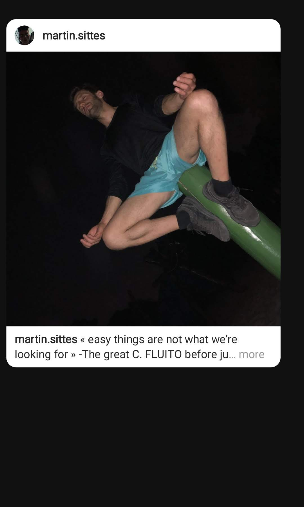
```

Besides, concerning work, I also experienced recurrent existential crisis. One morning, I wrote a letter to my friend Al.

#### Letter to Al. (2019-08-27) {-}

13.16 

Louvain la Neuve (Belgium), my office. 

Extremely unfocused. 

Hello Al., 

I write in English to save a translation in the future. All will be published.

It has been some strange days and I keep on questioning what I really want to do with my life and my time. I ask people around how difficult life is, but they don’t seem to understand what I mean by that question. 

Putting it simply, I have two options. Option one is to continue with the Ph.D. here in Belgium where I feel I am not growing enough, I am not contributing enough, and I am getting to comfortable and stable. Pros: I am saving about 1.500€ per month, which has let me accumulate about 20k along these two years in Brussels. It is a comfortable life, not many responsibilities, not many stresses, not rushed schedules. I have time to read, which is something I am probably overdoing. I have time to write, which is something I am underdoing. 

Option two is stopping with the Ph.D. and investing my 100% in my independent online projects, my writing projects, and joining MindValley, a company with shared values and aspirations. Cons: Fear, unpredictability, instability…

Asking around gives me ambiguous answers. F., the Ph.D. student that finished this year and is leaving this month, almost fully regretted the experience. It may be his negative personality, or the fact that he didn’t properly manage his time, social relationships, and growth along these five years in Belgium. He said that doing a Ph.D. in Belgium has one of the best conditions in the world. He still stands by it. Conditions are great: good salary, not much work, and not that much pressure. However, for him, the whole experience has been a painful one, with his mind worrying him constantly, and being upset about the consequences of his academic decisions. Being fair, I think that he is way more careful, meticulous, and dedicated than me. Luckily, my mind is more under control, or that is what I like to think. So it doesn’t bother me much, at least with things related with the Ph.D..

Second person I asked was Fe.. Fe. is the cleaning lady of R., the landlord of the building where I live, the owner of Mortimer, the dog I dog-sit. Fe. told me that I should stay in Brussels, saving money, making up my small fortune. 

Money is good, money is okay. But when I look at the future, when I look at the past, I have the feeling that I have mortgaged my life to money. It seems that I have taken so many decisions just based on money that it is a bit annoying continuing doing the same after so many years. Why didn’t I go to the Jamboree 2011? Money. Why did I live alone in Salamanca for two years? Money. Why did I live in the terrace of a house with 20 other students in Leuven? Money. Why did I go to Denmark without knowing anyone, without having any clear plan? Money. Why did I destroy romantic relationship, and friendships in the past? Money. Why did I travel the way I travelled? Money. 

I am not complaining or regretting all those decisions. Many of them were mistakes, many of them made my life more miserable that I would probably need. But all of them made me who I am today. That is what it is, and there is nothing I can change now. 

But remaining here for three years more just for the money seems a bit of a stretch of what I actually want to do with my life. Fi. says that I will get a qualification when I finish the Ph.D., but do I want a qualification? Do I want to spend three years of my life here for a qualification? I am not sure at all. 

I want to create an impact in the world, I want to change things, I want to see how people change their views about life, about spirituality, about ecology, about their behavior and its consequences. And what I am doing are petty experiments about whether nature affects moral behavior in urban dwellers. Well, nature is disappearing, so, who knows? Being on nature makes people more prosocial, more helpful, more generous, more altruistic. But then, it is our project, where we try to tackle if nature's moral impact reaches further. Does nature make people more conservative, more progressist? Who knows? We don’t.

Anyway, one of the advantages of being here is that I can see how science is built, how it is constructed. If I had my doubts about psychological science before, now they are not doing anything other than increasing. There are not clear results, there are just stretched conclusions out of statistical findings of dubious quality. I am fully ignorant about other science supposedly more rigorous, like medicine, or biology. But considering social sciences, I would remain doubtful in the best of the cases. I think that, by 2030 global data and artificial intelligences will discover more about human beings in 3 months, than what we have discovered in all previous research combined. And of better quality. Anyway, we do our best, and that should suffice. 

But it doesn’t not satisfy me. Supposedly, we can divide people into satisfiers and maximizers [@parker2007maximizers]. I am a *satisfier* in all those petty decisions that I think will not have a huge relevance in my life. But concerning what I want to do with my time, how I want to spend it, and with whom, I am quite a *maximizer*. I have been alone, and I don’t have numerous people that fully inspire and motivate me. But I prefer that than having tons of shallow relationships that I feel are leading me nowhere.

I wrote it in a letter to a friend a couple of days ago. I was analyzing why I am sometimes angry or hateful towards people and the idea of sexual frustration appeared, but I discarded for the probably more accurate explanation of *connection frustration*. That is the thing, I am having difficulties with finding people that really fulfill me and that interest me as a person beyond spending some evening together just letting the time pass by.

We will see what the future brings, and maybe, if it brings some interesting connections and people that make me grow, I will consider a bit further my situation. 

However, I can only blame myself for the promotion or lack of growth. I know that I am a bit stuck these days because I have altered many elements of the well-being routine that I was developing. That is what happens when I travel. I have enjoyed and grown a lot during my weeks in France and Vienna-Slovenia-Croatia, but when I see myself in Brussels, I have to work hard again to recover the habits that took me some time to build. Also, in a couple of days I am flying to Poland for a conference, which implies another week of rupture of my habits. 

These days also, I am trying a diet that I think I am going to quit. I have been happily eating from the trash during the last year and a half, saving money and reducing my already precarious consumerist behavior. However, I wanted to give a chance to a raw vegan diet consisting primarily of fruits, but it has been more difficult than I thought. The advantage of this small experiment is that I am more conscious of what I eat, I can fast for longer, keep on functioning with low levels of energy, and probably, I have cleaned my body from many accumulated toxins. But this morning, I was about puking. The last thing I ate were some grapes last night, and today at 11 am, about 12 hours later, I was feeling like vomiting. Later on, when I went to the toilet, I had some problems as well, but I couldn’t remember what I had eaten to have those difficulties. Anyway, I bought a baguette, I ate it, and it seemed that the bread did well in stabilizing my stomach.

One of the reasons I wanted to try this diet is that a friend of a friend, who, by now, I can call my friend, recommended it to me, mentioning that my intuition would get way better. You know that I am a bit skeptical of all those things. But I am receiving similar information from different sources and I am always open to giving it a chance and playing around with my brain and life. Actually, after my Vipassana experience, I cannot be sure anymore of what my body and mind are able to do; and observing how science is being constructed, I am open to trying more esoteric things just to see if they have any type of impact in myself and the way I function. 

Thus, I know not growing is my fault, and I actually should save some time to develop my intuition. There are several exercises to practice. During the weekend, I found some time to practice some of these, and I got scared at the fact that many things seemed to match, to have sense. There is this concept of “synchronicities”, of weird coincidences that seem to have been designed for us explicitly, to give us a specific type of lesson, or a message. And when I pay attention, many of these seem to happen repeatedly. I am meditating, I get to a conclusion, and the alarm goes off. I am talking with someone and before sending a message that I shouldn’t send, my phone crashes down… I am not sure whether I am going crazy or there is a reason all this is happening to me. 

The thing is that I am deeply afraid of following my intuition, because following my intuition would surely mean to stop with the Ph.D. and venture forward to do something that I find more meaningful and valuable. That is the thing. “What if’s” here and there. Those are my fears. If I should go against the rational and common sense, secure view of life and stick to the Ph.D. for three years more while I am saving money and earning a qualification; or dedicate my full time to focus on what I really believe that can change the world and have an impact on society. I haven’t checked my intuition, or I haven’t tried all the opportunities I could try, and it is because deep inside, I have the hunch that they may offer me a future that I like more than what I currently have, and that would make things more difficult. 

The safest way is to keep on developing my online presence and profile while I am doing the Ph.D., but these divided purposes don’t match anymore. Also, another problem is that when I have a free day, I find myself procrastinating and not doing what I should be doing, what I have to do, my commitments, which makes me question about myself and my validity as an independent worker. I am a bit trapped in this.

Also, I am in a moment where I would love to work with other people, with people that can push me forward, that can bring value to what I do and what I have. But it seems complicated to find them. I also remind myself many times that I have to be patient, that I have to work daily with the focus on the long term, and don’t stress out myself with what I already have and where I am going. It gets a bit complicated to handle the pressure that I put on myself for these types of matters. It gets confusing as well. 

I don’t know, Alvaro. I am sharing this with you because we recently talked by instant messaging and you know how little I like superficial things, and how keen I am of more meaningful stuff. I am not sure whether your advice, if any, is going to be the one I look for, or one that really works for me. Difficult to say anyways. But it would be interesting to know about the changes that are going on in your life right now. Let me know. And yes, let’s meet at some point. Not so late.

Best, 

Carlos


---------

The day before Poland, I tried to be social again. I met a young guy that has just started his path on personal development. It was charming to observe somehow, due to his humble and quite uneducated origins, combined with a strong commitment to work hard and push himself beyond his dreams. It was a bit cliché hearing all those coaching slogans and lessons that, from my opinion, I had not only overcome, but improved and nuanced. Anyways, he was brave, since he was barely speaking english, and was already working and living in a foreign country. I wanted to amuse myself, so we went to the park, and I spent some time practicing my new hobby: funambulism. I liked those Russian guys that filmed themselves climbing buildings, and walking on cornices. It was the excitement I needed in my life.The only stimulating challenge that I could find around me. And to a more archetypical level, it was a perfect metaphor of the situation I was entering in my life. A lot of potential growth with a lot of potential damage.

```{r balance, fig.margin = TRUE, out.width = "50%", fig.align='center', echo=FALSE}
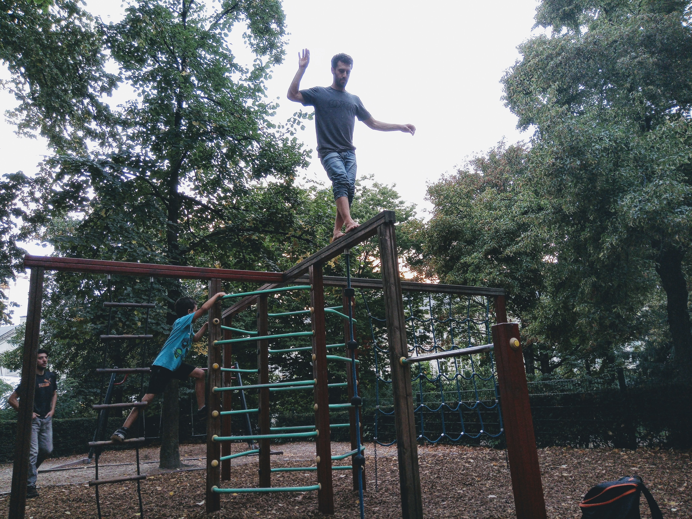
```


At least, I had the conference in Poland (2019-08-29 to 2019-09-03) about Psychology of Religion . Ironically, I consider that, professionally speaking, my biggets improvement was done by establishing an email communication with Ad., the father of my friend B. who is a well-known Croatian publisher and writer within the world of spirituality that was kind enough to give me some feedback and guidance concerning my ideas on spirituality. 


#### Correspondence with Ad. (2019-08-22 to 2019-09-03) {-}

2019-08-22

Hello Adrian, 

I am Carlos, B.’s Spanish friend. I am aware that he has talked to you about me. :)

He mentioned that it would be possible for me to share some of my text and ideas with you, and in case you liked them, we could agree with publication planning.

I wrote an index with the idea of a book linking spirituality and science from a psychological perspective. I would like to share the index with you, receive feedback from you, and then move forward with the writing. It would be great to know what is your preferred way to share this with you.

Thank you very much for having such a wonderful kid, and thank you for all the value you are bringing to the world.

Best,

-----------

2019-08-22

Hi Carlos,

Yes, B. told me about you. I am glad that you two are friends. :)

Not sure, though, what you expect from me. I am not a publisher, and as for writing, well... One would think that 40+ published books is a success, and for sure it is a kind of success. But, I am not feeling qualified for guiding a young aspiring author, such as you.

But we can talk if you like.

Instead of an Index, tell me what you want to say through your writings. If you can say it in a few sentences, your ideas are probably clear and worth pursuing.

Adrian

---------

2019-08-31

Hello Adrian,

Thank you very much for your answer and for your interest in my person and development.

B. mentioned that you were thinking about opening a publishing house. Also, he mentioned your numerous creations and that is why I still think that you could be a great influence and help for my development as a writer.

I am currently in a conference about Psychology of Religion in Poland, so it has been a busy time with the preparations.

What I aim with my writings is to re-discover spirituality from a (scientific) psychological perspective. My three attitudes in this exploration are humility (I don't know), curiosity (I want to know), and doubt (can I believe what I am told?). My goal is to learn how to elicit spiritual and transformative experiences in people as strong as the ones I have experienced in the past (that changed my being and the way I understand the world). Spirituality can be the perfect tool for achieving a change in the awareness that would redirect humanity towards a more sustainable and thriving future.

That is pretty much my goal for writing and publishing.

Some of my beliefs and approaches are that spirituality is an alternative functioning of the brain and the mind, that has a specific set of characteristics. The development of a spiritual life makes people behave more prosocially. Concerning religions, for me, religions are metaphors. Religions are different manifestations and interpretations of that core spirituality that we all have inside.

From my training as a positive psychologist, I can easily relate many spiritual feelings and emotions with positive emotions studied by scientific literature. However, there are a huge amount of mysteries that are still to be studied and untangled.

I hope I haven't gotten too long with my explanations. But those are the main motivations and ideas that are around my mind at this moment. I would like to bridge scientific studies with more esoteric aspects of spirituality and re-interpret religious text under the perspective of science; using ancient scriptures to develop new theories and hypotheses.

Thanks for your time,

Carlos

----------

31.08.2019

Hi Carlos,

:-) As I wrote, we can talk. The outcome... who can say? :-)

Let me answer your third question (“*Can I believe what I am told?*”). You can't, and you shouldn't. Ever. :-)

As for the rest - it sounds nice, but... Is there any definition of "spirituality" you accepted, so you now operate under its premises?

Because, you know, "spirituality" is a vast field, somewhat chaotic, constructed from a milliard of different approaches (sometimes opposite to one another), and practiced by so many people with so many goals and, consequently, resulting in so many outcomes.

I hope you are not from those who would say that "all is one" and "all paths lead to Rome" (because they don't). :-)

I am in "spirituality" from my 13th birthday. It is more than four decades of lifelong dedication, no compromises, no sidewalks. I have seen and experienced so much that the word itself - spirituality - doesn't mean much anymore.

I deal with people who want to cure insomnia with the mediation; spiritual tourists going on every new workshop in town; new-age types who desperately want that life would be only about hugs, kisses, and flowers; losers running away from responsibilities; goal-driven manifestators; religious renegades disappointed in the institutions but firmly sticking to their beliefs; honest but lost searchers who just want the peace of mind; health fanatics... and many more. Here and there, rarely, I came across someone ready to look into the true reality of our lives, no matter the cost.

All those people practice different techniques with different results. Some of them are better off after that, but I have seen the psychosis and other serious disorders directly resulting from practicing "spirituality." Yes, sometimes, "spirituality" was the cure for that, of course.

So, to cut things short - what are you talking about? :-) What spirituality?

Cheers,
Adrian

PS: You wrote that you are a "*positive psychologist*". I am ignorant in such distinctions, so I will just ask - are there "negative psychologists," too? Or, "neutral psychologists"? :-)

-----------

2019-09-03

Gdansk, 

Hello Adrian, 

Thanks for keeping on challenging my boundaries. 

Today is the last day of the International Association of Psychology of Religion 2019 conference here in Gdansk. It has been a wonderful place to get inspiration, expose myself to many different approaches to spirituality and religion, and to stimulate my mind towards developing more operationalizable definitions of spirituality. 

I wouldn’t like to be reductionist, but this morning, talking with a potential collaborator from an American university, Christopher Silver, I remembered some ideas that I had a few years ago and that are, what I considered, the foundations of “spirituality” or “mysticism” as I conceived it.

Referring again to my formation as a psychologist, I would like to define spirituality based on its psychological characteristics and effects on psychological processes. 

I am aware of some of those interpretations and manifestations of “spirituality” that you mentioned. Indeed, coming to this type of conferences is really helpful to keep on broadening my mind about the endless interpretations and outcomes of “spirituality”. Religious and spiritual, spiritual and non-religious, many possible religions, many types of practices, many ways to say what “spirituality” is, and what is not. That is why, today I realized that researching about the most basic psychological processes and its connection with “spirituality” should be a solid starting point.

I believe **spirituality happens on the mind, on the brain**. I don’t know if it happens outside (energies, and souls), but for sure, at some level the mind and the brain are involved. That is why, **attention**, as the most basic and undeniable access of information to our consciousness, is surely playing a key role. Then, at the **perceptual** level, sensitivity, the threshold that allows people to perceive, “sense”, reality is filtering what enters the consciousness. Attention is the door that communicates the reality (inner and outer world, e.g. thoughts and feelings) with our perception, which allows information to enter in our consciousness. In the same way attention can be trained, (Anapana meditation), sensitivity can be trained as well, (Vipassana meditation, and subtle levels of our mind/reality). Thus, we could develop an increased or heightened awareness of the world, an expansion of our consciousness.

Thus, **spirituality is an alternative functioning of the mind** (not experienced by westerners’ minds on a daily basis) that is characterized by a **more focused and controllable attention** (stronger *samadhi*, as I understood it in my Vipassana meditation course of 10 days by Goenka), an **increased levels of sensitivity**, higher usage and trust on **intuitive thinking, and reduced logical-mathematical thinking**  (non-duality phenomena), difficult to verbalize (ineffability), that is felt as truth and valid source of knowledge (noetic), general **positive affect and mood**, and **overall optimism** (hope, tolerance, forgiveness); together with **several cognitive biases**: finding meaning in aleatory patterns, anthropo-teleological reasoning (explanations of the universe on base of its functionality for human beings, e.g. “The earth has been created for humankind to live in”), and others that I would need to examine and think about more carefully. I would take a **phenomenological approach** and define spirituality based on what seems to be **common among different cultures and religions**, instead of focusing on the different interpretations of these processes. Although, from a cultural perspective, spirituality is the term used by many people to frame this different psychological phenomenology, while trying to avoid the mythological and cultural elements. 

Thus, with a more cultural approach, **spirituality is a non-theistic individualized, and tailored religion**. It is a **self-developed set of beliefs and practices** that aim to **connect the individual with the transcendence**. In many cases, this spirituality is sparked by a mystic experience, and refined and developed through time, by trial and error of different practices and a process of updating personal beliefs. 

I am not denying any epistemological possibility with my definition. I am simply recognizing the existence of the experience, and claims of “spiritual people”, while not denying or supporting the validity, or “truthfulness” of the interpretations of these experiences and claims. Whether energy or karma are truth or not, it is unimportant at this point, what it interests me is that people experience these situations, and how science could explain what is going on, exploring all the psychological alterations further than cognitive biases that lead to questionable judgments about reality.

For example, I like to explain the concept of karma (softer westernized version of: “You do something good, and good things happen to you”), as a form of prosociality spread through the social network. Or the concept of reincarnation as how our “self” and worldviews are constantly changing (e.g. when I wake up in the morning, I am not the same person that I was when I went to sleep. It seems like I have been reborn, that I have been reincarnated in a new person).

As I mentioned in my previous email, I would like to bridge between atheist denying the potential benefits of exploring their spirituality, beyond claiming about the truthfulness of its content; and those people that consume commercialized spirituality with a potential risk for their health (e.g. anti-vaccines, or people that avoid western medicine to prioritize alternative therapies). I try to keep my humble attitude and I wouldn’t like to impose my reductionist scientism to dictate what is good and what is bad. I think we all should strive to find the truth and communicate and spread these different worldviews.

About the “all paths lead to Rome”, William James in *The varieties of religious experiences* [@james1985varieties] wrote about the common phenomenology of a mystic experience (“one path leads to different Romes?”). The mystic experience seems to be happening on healthy human beings. It is afterwards, when the interpretation and the set of beliefs of the individual when this “one path leads to different destinations”. 

In my case, I was lucky to discover Taoism simultaneously with my first experience, so I could apply my (non-)interpretations of the frameless frame (ineffable truths) of the Dao De Jing to my mystic experience. This allowed me to interpret many other religions and start making sense of what “God” and “Jesus love” could mean for many Christians. 

[Positive psychology](https://en.wikipedia.org/wiki/Positive_psychology) is a movement in the scientific community to promote psychological research in the “positive” aspects of life (pleasurable emotions, social relationships, engagement at work, virtues and character strengths, optimism…). I got interested about it during a lecture on my last year of university. After my first spiritual experience, I felt numerous “positive” changes in myself (I was happier, more motivated, prosocial, patient, optimistic…). Thus, I thought that positive psychology was the best way to approach the study of spirituality. Then, I read some of the works of the main authors on the field and enrolled in the Master program.

Nowadays, I am doing my Ph.D. with [Vassilis Saroglou](https://www.psyreli.org/saroglou) which has extensively researched different links between religion, spirituality, transcendental positive emotions, prosociality, personality and culture. He is well-known in the field, and I feel lucky to work with him. However, the topic of my Ph.D. is quite limited, and I would like to read, write and explore many other topics that are not as scientifically accepted as the relations between nature and morality. That is why; I would love to publish papers about potential psychological interpretations of Hinduism with B., and I would love to receive some orientation about how and what to publish about the ideas aforementioned; how to make them attractive and accessible to a broader number of people, and how to present them in an organized way, easy to understand, and applicable to one’s life.

I hope I have further clarified my point of view and that I haven’t extended myself too much with the length of the email.

Thanks again for your time. 

Carlos 

-----

Hi Carlos,

About challenging your boundaries, well, you asked for it. I'm still not sure if that will do anything good for your writings, but let's see… :-)

Long it is... :-)

> Referring again to my formation as a psychologist, I would like to define
> spirituality based on its psychological characteristics and effects on
> psychological processes.

Linking spirituality to psychological processes would be very interesting, for sure. But, again, how would you do it if you deal with so many different things? You have to make a gross and fine differentiations inside the very - VERY - vast field. Otherwise, your results may show that "spirituality enhances XY, improves ZW, etc." while "spirituality" itself will be questioned. I can live with that, but I am not sure science can. :-)

I am trying to explain to you what happens in my mind when you write "spirituality." A similar thing would happen if you wrote to me that "you like to explore the influence of the material world on human psychology". It is just... too general, too vast. That is why I am suggesting to clarify to yourself what you are actually researching.

And you did it in the next paragraph in your mail. I have nothing against it. All that is indeed spirituality - with all its contradictions and vagueness. I made some comments as pointers in the direction beyond spirituality.  They are just quick thoughts.

It is not clear to me where the distinction is between inside and outside the mind. The very existence of "outside" is a non-provable assumption (made equally by scientists, common people, religious and spiritual). 

Attention makes you aware of something that is already there, regardless of your knowledge about it.

There is no such thing as "expansion of consciousness". :-) It is just a phrase. What is possible is the expansion of awareness - you can become aware of what is here using specific techniques.

A lot to say about attention. It would be too long. Short version, focused attention is not samadhi. And focused and controllable attention can be developed without any need for spirituality (whatever it is). It is just a human ability.

About sensitivity, do you mean perceptual sensitivity? Better sight, hearing? Again, not exclusive to spirituality.

What is "higher usage"? Who is to say that using an ability is low or high?

Oh, non-duality is much more than reduced or non-logical thinking!

Trust in the intuitive... Well, do you trust your hands that they will be able to type an email? If "trust" is the correct word in that case, then ok, you can say that you need trusting the intuition...

About ineffability, noetic, positive mood and optimism, nice. But that has nothing to do with truth and reality. It has everything to do with human needs and interpretations.

So, you see - a very vast field, that spirituality!

The problem is: if all that goes under the name - spirituality, do you really think that there is a set of patterns, a distinctive model of the brain (or mind) that would show - this is spiritual, and that is not?

About the phenomenological approach, well, if you remain descriptive, you are on much safer grounds than if you try to explain what is happening.

> Thus, with a more cultural approach, spirituality is a non-theistic individualized and tailored religion. It is a self-developed set of beliefs and practices that aim to connect the individual with the transcendence.

Maybe. The problem is that "set of beliefs" cannot connect you with the transcendence (of course, you will have to explain what you mean by that - the word transcendence, and the idea of connection, both). Practices can do that, but not all of them.

As far as I am concerned, at the moment belief enters the stage, the truth has already left it.

About your focus on the experiences, it sounds good. If you can clearly say what experiences you are considering spiritual, and clearly distinguish them from the ones you consider non-spiritual. That is a hard task, you know.

No objections to your interpretation of eastern concepts. :-)

I understand your intention of bridgening different audiences. It is just that the "truth" and "worldviews'' are not on the same level of existence.

Yes, experiences happen to humans. And what you mention is possible. But, there is a plural: mystic experiences, not one mystic experience. And there are interpretations of those experiences.

So, I suppose there is no "negative psychology". No one is interested in that. ;-)

About your Ph.D., it sounds great. My recommendation is to suppress your other interest and focus on your Ph.D. topics as adviced and approved by your mentor. Once you gain academic authority, you will be much more free in your choices of topics and writings.

Publishing with B. is an excellent idea, and you both have my full support if you decide to do it.

Well, as the one being on the market of books for almost four decades, I can tell you that it is not an easy task. You will have to make compromises with human desires, needs, beliefs, and even fashion. And I still have no recipe for achieving that efficiently. Probably, the best thing is to start with simple ideas, not too general, and as practical as it gets (the scientist and academic in you will have to go sleep for a while, or at least withdraw himself from the spotlight).

No problem, Carlos. I am glad to talk to you. At the moment I have some extra time, but very soon the season of lectures and workshops will begin. I am also preparing a couple of new interesting projects, so I will write as time allows.

Wishing you all the best and thank you for your interest. It is of great value that young people like you focus their attention on... well, that damn spirituality. :-)

---------

During the days of the conference, I kept my mind busy and my social needs somewhat satisfied. However, I had a strong outburst of loneliness during the last day of the conference. the whole academia world seemed very unreal to me compared with the rawness we have lived in France. I missed that authenticity that I couldn’t find among scholars. I felt disconnected from my colleagues. I felt disconnected with the rest of researchers and academics. After my presentation, the nervousness of preparing my talk gone. The emotional opponent process wasn’t relief, though. It was emptiness. And I fill that emptiness with feelings of disconnection from everyone. I wasn’t sure why I was there. 

You were in my mind, and it had been already 21 days of silence. I was completely puzzled. I had been thinking about you, struggling to control myself and not texting you. But that day, I couldn’t. I texted you. I tried again. 

<div style="text-align: right">

--- *A.*

*Can you send me the pics of the exchange, please?*

*And I would like to know if everything is fine*

*What in your mind and all that*

</div>

The messages appeared as read, but they remained unanswered. Some of my friends were already recommending me to be over you. You had ghosted me. You had flaked on me. I just had to accept that you were over. Probably you had read something from my letter that you hadn’t like. Well, it happened again. I never learnt how to keep playing the rules of the game. “*Don’t disclose all the information at once. Don’t give away all your power.*” I thought that with you it could be different, that I could be myself, that I could be open and honest. And there they were the results. 

Full silence. 

### Requesting divine interventions (2019-09-04 to 2019-09-07)

One day later (2019-09-04), I decided to text K.. It wasn’t the smartest, but I didn’t have a clue about you. My mind was going to multiple places, to numerous possibilities. I didn’t want to buy the version where you have just completely forgotten about me. I wanted to considered alternative scenarios. In the worst of the cases, you might be simply dead, or in the hospital, and I was waiting for your answer that would never arrived. I wanted to cleap up, at least, the worst of the doubts. 

 <div style="text-align: right">
--- *How are you?*

</div>

--- *Perfect!!! How are you??*

<div style="text-align: right">
--- *I’m in Eindhoven now*

*After a week in Gdansk*

*In a conference of psychology of religion*

</div>


--- *And how’s going?*

<div style="text-align: right">

--- *Pretty well*

*I’m a bit stranged that Alissija stopped answering my messages*
</div>

She remained silent. I guess I fucked up by bringing up the topic too soon. But she wasn’t very talkative, and I had already asked about how she was… 

Next day (2019-09-05), I sent her a photo that was left unanswered as well. 

```{r fluito, fig.margin = TRUE, out.width = "25%", fig.align='right', echo=FALSE}
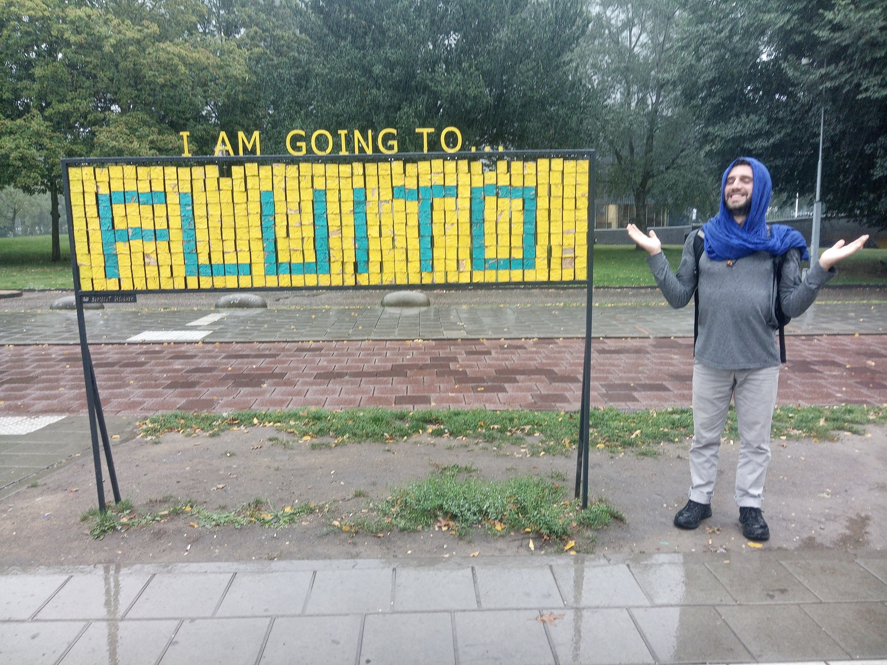
```

Well, I have just played myself. Two non-answering people more in my life. But I didn’t give up so easily and next day, I tried again:

<div style="text-align: right">
--- *Karolina stopped answered as well?*
</div>

--- *I didn’t like the fact, that you wrote me just to ask about Alissija.*
 
Ouch! Fully caught… However, she was talking. She was answering. I had to be smoother this time. 
<div style="text-align: right">
--- *I am always welcome to know about how your life is going*

*I told you as well my willingness to write letters so we can share each other’s experiences*

*If you got offended because of that, I hope you can forgive me*
</div>

She texted me a sort of letter:

--- *My dear Carlito Burlito,*

*It’s a big pleasure for me to be connected with person like you. Time we spent together was one of the most interesting moments in my life. Thank you for making me laugh* :-)
 
*Right now, I’m trying to figure out what would I like to study in future. For one moment I even wanted to study medicine.*

*What about your life? Why you decided to study psychology?*

*With best wishes and kisses*

*Your K.*

Well, that was the best I could get for the moment. 

<div style="text-align: right">

--- *How long do you want the answer?*
</div>

--- *The same as I wrote you* :-)

That was a challenge, since my letters averaged four pages in a word file at that period of my life. But I tried:

<div style="text-align: right">
--- *My dear Karolina,*

*I also learned lots from you and our conversation. Thanks for keeping me humble and reminding me that my worldviews are very limited.*

*What are the options you are thinking about? Medicine is a great career. If you finally choose it, apart from helping human beings and saving lives, you'll discover the intricacies of the human body functioning, which I also find compelling.*

*About my life, as I mentioned, all is good, but the realization that the person that I thought I could open up and trust on now stopped communicating with me without any explanation is quite disturbing and hurtful. What would you do if something like this happens to you?*
*I chose psychology because I wanted to understand human beings, I wanted to know why we are as we are, and 9 years later, although I have partially solved many of my doubts, human beings keep on surprising me and catch me unprepared in many occasions.*
 
*Always learning.*
 
*Love and peace,*

*CF*

--- *Bit longer, sorry*
</div>

Of course, it hurt. How was it not supposed to hurt when the person you trust, the person that supposedly love you and the one that you love stopped communicating for almost a month without any explanation after you shared your whole being with her? Really, that wasn’t supposed to hurt? But, the situation changed. My message worked wonders. Just 5 hours later, and A. broke 25 days of silence. K’s divine intervention had worked.

<div style="text-align: right">
--- *Thanks K.*
</div>


## Magnetism (2019-09-08 to 2019-)
### Intermittences (2019-09-08 to 2019-09-22)
You, A., broke your silence with a sort of letter, much in the way K. had done it.

--- *Hi dear,*

*Unfortunately the pictures are not in my reach at the moment.*
 
*Everything is as life is, you know *`r emo::ji("grinning")` *So it's interesting…*

*The school started, the homework started. I’m glad it's giving me these small goals to achieve. So I’m almost not overthinking. Just in the evenings. But also my overthinking is useful here. And all the other ''defects'' as they are usually seen are welcome here (at least I put them this way) so I feel like I’m in the right place.*

*I still do not have Wi-Fi (for two more days, I’ll get it on Tuesday) So don't be too sad that I'm not answering.*
 
*And how are you, dear Carlos?*

<div style="text-align: right">
--- *Thanks for the message. I'm still dependent on human beings.*

*Text you later*

*And thanks Karolina for her divine intervention*
</div>

So, that was it. You haven’t had internet in all this time. Your message was warm and sort of hopeful and positive. I was happy about how you were feeling like you were in the right place. I was somehow envy of you, since I was craving more artistic environments, and you were starting your studies of theater. 

I was relieved by your words, but I still remembered how much you had made me wait. Thus, I took two days to answer you back (2019-09-10). A picture of a kid grabbing a huge bug was very much a reminder of you. However, that day I didn’t pay attention to that octopus tentacle…

```{r offspring, fig.margin = TRUE, out.width = "25%", fig.align='right', echo=FALSE}
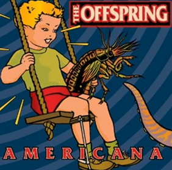
```
Many things were going on in my life during the beginning of September^[If you are curious  and you want to explore in depth my psychological world, I publish some of my [personal correspondence]( https://carlitofluito.github.io/letters2019_20/), [dreams and morning reflections]( https://carlitofluito.github.io/dreams/) as [Unfinished Books]( https://www.carlitofluitoideas.com/unfinished-books/). You may find new meanings and layers to the story by reading those.]

<div style="text-align: right">

--- *I would write you a letter about my mind/development, but I don't want you to feel force to write or overwhelm with my stuff*

*I can also briefly tell you that all is fine*

*And about you in the school, enjoy and grow*

*As you said "defects" are inspiration*

*and if your mind starts bullying you and you want to talk / write to someone*

*I listen*
 
*[These ones](https://www.facebook.com/pg/CuriosityOficialpage/photos/?tab=album&album_id=105749524134517&__tn__=-UCH-R) if you get bored* 

</div>

I sent you some pictures of animals that I thought you would like, since the pics were very well done and the animals were quite weird. Considering how much you enjoyed doing pics to dead bees, and observing bugs, it could surely be a good thing for you.

Ironically, K. answered me to my last question about “*What would you do if the person you trusted stop talking to you?*”

--- *Good evening.*

*Thank you for writing me back and for waiting my answer.*

*About the person who stopped talk to you. Maybe this person is really busy, or “she” doesn’t ready to talk right now. Actually, I’m at the same position as you right now. One man who I felt in love with just stopped talk to me. But I probably understand why. So, we both, me and you, should learn something from this situation. *

*Right now, I feel a little bit pain, but I realized that I can use it to create music. And when I look at the young girls, I don’t want them to feel this pain I did. But somehow it changed me, so I don’t know now, if it’s good or not.*

*Hug you very tight* `r emo::ji("heart")` 

*And wish you a good night!*


Two days later (2019-09-12), which I understood as an okay time for answering, you wrote back:

--- *Oh here I am afraid I have no time at all to be bored.*
*You can write me a letter if you wish to share, I will not feel forced to reply right away, besides I believe you understand the business of shit I’m dealing with in this school now* `r emo::ji("grinning")`

*Oh btw do you know to recommend me some theater schools in Spain (knowing my interests briefly) where I could go for a semester?*

<div style="text-align: right">

--- *Remind me your interests*

*I know more about dance than theater, but I have some friends that have done acting/directing*

</div>

The day after (2019-09-13), I felt deepy misserable. I had been overusing my phone, it was Friday

Meanwhile, I was talking with K. Our relationship seemed to be warmer.  who had posted on Facebook a quite insinuating thought. I felt motivated enough to write her a proper letter

#### Letter to K. (2019-09-16) {-}

Louvain La Neuve, Belgium

Hello K.,

I am not used to quick, short letters written under pressure. I prefer long ones with the possibility of spending weeks without answering. To strengthen my patience, the receiver’s patience, and adapt to the unexpected evolution of life. Instant communication is just to give messages about how everything is going well, asking for emotional or practical support in moments of need, or arranging and organizing meetings. That is my view. Although, I understand that it is not really accepted. Other’s people problem. 

Actually, [I don’t have a smartphone anymore]( https://www.youtube.com/watch?v=WX82WsXTUNc). I am using an old phone with keys and all that. My life has gotten so much better just with this change. If I miss my smartphone, I will consider coming back to it, but I am really pro old phones. At least, I have a strong excuse to be isolated without feeling lonely and recognizing who are the people that really care for me (those that call and send SMS).

About A., “*the person that stopped talked with me*” (funny that reminds me to Voldemort’s nickname: “*he who must not be named*”). As I mentioned in the previous paragraph, instant messaging is to check that everything is going fine. I am way less empathetic than you, so, if I send a long text talking my mind and then I received three weeks of silence, it is a lot of time to make theories in many directions. A friend also told me the hypothesis of “*It is nothing about you*” a.k.a. “*She is busy*”, “*Her cat died*”, “*She lost the phone*”, whatever. Anyway, for this, I think like Nietzsche 

> “*He who has a why finds a how*”. 

In the hyperconnected world that we inhabit, it is always possible to let other people know that we are alive. And I have to admit that I am pretty bad at that since my mother used to complain about this on the past. Now, she accepted and understood that I am usually fine, that I like to do risky things, that I may or may not be at Brussels at a given point, and that I usually appear in Spain with maximum one-week notice. It started to happen when I was living in Barcelona (at 20 years old) and I was mentioning my trips around Europe with one day of advance, or when I was already in a foreign country, like a spontaneous trip I did to Germany. Thus, I developed a really familiar feeling with travelling around. My mother is fine with knowing about me sporadically or following my social media and knowing that I am alive. I am not saying that is good or bad, but people get used to everything. 

In the case of A., well, I was worrying. Once, she answered, I could understand better that she is having a busy period and that whatever she experiences there (at the school), she will share it with me if she wants.

About you and your “*man in the same situation*”, life sucks. Well, people suck. Life is fine. If you understand why that guy stopped talking with you, that is fine. Good for you. If you don’t, ask. If he doesn’t answer, people suck. But I have noticed that girls have a stronger conditioning to not taking initiative in many situations, from the first kiss to the first message. Go over it; expose yourself; become vulnerable and change the rules of the game. If it doesn’t work, at least you tried. I don’t want to imagine the amount of suffering that so many girls have caused to themselves for not taking initiative. You know, maybe the guy actually wanted to meet you and talk with you, but you didn’t write that message because girls don’t write messages first. Those are my prejudices. Take them as you want. 
Last Friday (2019-09-13), I was really down. Today, Monday, I am up again. Leaving the phone aside and re-connecting with my life and who I am had helped me a lot. I wrote some letters to a couple of friends and, although they didn’t answer yet, writing did its magic. Self-confrontation is always helpful. As you said, low moments are pretty good for artistic inspiration. However, they are also shitty, and in this period, I am discovering that creativity can be brought up almost whenever. In any case, the picture you posted on Instagram with the guitar was simply gorgeous. To make the work of future historians easier, here it is^[I chose not to add it in order to preserve her anonymity.].

I am not sure whether pain is good or bad. I read from Jonathan Haidt in *The happiness hypothesis* that existential crisis in our young adulthood are mentioned as the most meaningful events of our lives later on life. In my case, it was a love rupture and emigrating [alone to Denmark](https://carlitofluito.github.io/letters2014_15/). It was painful, it made me grow, and indeed, it has shaped who I am. I miss it somehow.

About the Sonian Forest (Fôret de Soignes), it is wonderful. Actually, Friday, I was super nervous, also feeling lonely and shitty, and I took the decision of going from La Hulpe to Brussels by foot, about 14km in a straight line that I didn’t make. I didn’t want to check my phone, just test my brain. Therefore, I got lost. I walked in circles, I climbed fences, and I avoided paths. It was pretty refreshing. I would have loved to do it with someone else, but it was still worthwhile. I cannot say where I was, but it was a wonderful five or six hours walk. I don’t know. I thought about doing it barefoot, to remember A.’s lessons. But I climbed over a fence, I started bleeding from my hands, and I decided to keep it easy. Also, I was in private property at some point, so it would be good to have high-mobility opportunities, just in case. I also realized that not everyone is my friend and that I should protect and invest more in myself and the relationships that I already have. Also, to pay more attention to the people that believe in me. Besides, I forgave some people from my past, which is the spiritual work that I am doing nowadays, and I kept on losing myself.

If you feel in pain, write to me. If you feel lonely, write to me. I know pretty well how shitty feels to be felt alone, thinking that no one in this planet cares for you. It is just inaccurate, at least in your case. 

About your Facebook post. For historians’ shake: 

> “*Awareness and acceptance that we are killing the environment is the same as a person who suffers from a serious illness and who knows that he will die soon.*
> 
> *If, in fact, nothing lasts forever, then why am I still striving to make it so?*”

It is pretty hopeless. Hopelessness is a predictor/correlator of depression. My addiction to life is based on my mind clinging to hope. I told many times to myself that I would never commit suicide because I simply don’t know. I don’t know if today on the train I will meet the person of my life. I have the hope that that can happen, and that is why, no matter how shitty I feel, I will keep on trying. I will die trying.

I think that your comment is arrogant. It lacks humility. Humility sparks hope. The person that is ill doesn’t know if someone is going to discover the definitive cure that will bring back its health. In the same way, we don’t know if someone is going to bring up the solution for the environmental crisis. Anyway, what we should do is twofold: first, being as careful as possible when living in delicate situations (like being ill, or the highly damaged environment); and secondly, enjoy to the most while it lasts (always keeping the first premise on mind). It doesn’t serve any purpose to enjoy while destroying ourselves. Hedonism manifest way more intensely in a healthy way than in a destructive one. Basically, because you add the layer of meaningful hedonism. You are not doing something that you enjoy, you are doing something that you enjoy, giving an opportunity to others of enjoyment, and giving meaning to your life, which opens up a deeper level of existence.

Nothing lasts, forever, indeed. For the shake of historians: 

[RANDOM WISDOM #1. Todo se acaba/Everything finishes – Carlito Fluito](
https://www.youtube.com/watch?v=gnD0GyH2g7w). Put subtitles.

2016-11-16, already speaking shit on YouTube. 

> “*Todo, todo, todo, todo, todo se acaba*.” 

Anitya.

> “*So, when you realize that everything finishes. You stop thinking that it is bad, and you stop thinking that is good. And you realize that it is what it is. Then, maybe, we learn to suffer a little less...*”

2018-08, at the Vipassana, crying, because this universe is going to go through a slowly decaying process of death ([Three ways to Destroy the Universe – Kurzgesagt – In a Nutshell](https://www.youtube.com/watch?v=4_aOIA-vyBo).) The teacher asked me if I was having strong emotions coming out. “*Some…*”, I answered. “*Life is suffering.* ([Vipassana, my experience – Carlito Fluito](https://youtu.be/l17lZ2T-zWE?t=344))
  
So, yes, nothing lasts forever, neither life, neither the environment, neither your ideas about the fact that nothing lasts forever. Thus, trying to make it last forever will bring suffering, but accepting it and enjoy what you have now will bring different sensations and emotions to your being. I opt for the second. Some people may say that I am shallow. I think I am practical, pragmatic. Once you go deep, you better become pragmatic if you don’t want to sink. 
And this is my mind today, after a couple of days without smartphone and feeling very released.

Thanks for reading, K.. As I mentioned, I think we should meet (Estonia, Belgium, somewhere else?). I don’t care, and I don’t mind. The relevant people in life should be preserved. That’s it. With the years, I have learned to preserve those that make my life more interesting and enjoyable. You are one of these.

So, if you share this with me, choose a place and a date, and let’s improve the quality of our existence, at least for a weekend. After all, we know that everything finishes, and we usually know when things start. But we don’t know what is going to start, and we don’t know when it will finish. Read this twice.

Huge hug, 

CF

--------- 

Although talking with K. was getting easier, and I was already envisioning she and I walking around the forests of Brussels, with you, I was still puzzled about how to figure out your state of mind, and the situation of our relationship. 

After a week of silence (2019-09-19), when I have tried to put you outside of my head and wait patiently, all indicated that you have forgotten about me. Again.

<div style="text-align: right">

--- *reminder* `r emo::ji("slightly_smiling_face")`

</div>

--- *of what?*

<div style="text-align: right">

--- *about your search of theater schools in Spain*

</div>

--- *oh thank you for the reminder, i already managed*

It was still me the one creating and maintaining conversation

<div style="text-align: right">

--- *good then*

*how are you doing?*

</div>

--- *sick a bit*

*good in general*

*just needing some rest*

<div style="text-align: right">

--- *it happens*

*body wisdom*

</div>

--- *yes*

*how are you?*

I was surprised you had even asked. Still many things were going on with my mind and life, I was questioning what exactly I was doing in Brussels, and what I wanted to do with my life. Using the chance that you had given me, I proposed that we talked.

<div style="text-align: right">
--- *well*

*ups and downs and downs and ups*

*conflictive selves*

*atemporal shit*

*do you want to talk?*

*Call*

</div>

--- *i just finished a 2 hour phone talk* `r emo::ji("grinning")`

<div style="text-align: right">

--- *I see*
</div>

Not today, I guessed. My bad luck manifesting. Next time, then…

<div style="text-align: right">

--- *karolina?*
</div>

--- *no*

I founded the trailer of your documentary posted on your Facebook profile. It had Estonian subtitles, so I didn’t understand anything. However, it was uplifting to see you again, at least in the video. It was very exciting to see that work that you have talked me about; to share a bit of that experience that you had told me it had been so relevant, meaningful and life changing. In the trailer, your personality was conveyed, and that messy facet of yourself was reflected in the chaotic aspect of your room on the background.

<div style="text-align: right">

--- *uuuuuu*

*I don't understand shit*

*I guess you ordered the room for the video*

</div>

You sent me the website of the project.

--- *there's one (trailer) with english subtitles*

*nah the mess is on the other side*

<div style="text-align: right">
--- *pffff*

*such a trailer*

*many emotions*

*makes me jealous for your experience,*

*and seeing you is great*

*makes me miss you*

</div>

--- `r emo::ji("grinning")`

<div style="text-align: right">
--- *If you find some time and inspiration to write, I would like to know about you*
</div>

--- *thank you for the opportunity*

*but i dont even have time to just be at this period*

<div style="text-align: right">
--- *iep, you told it the other time*

*but sickness can be inspirting* `r emo::ji("wink")`

*otherwise, we can find a day and talk*

*and I am still up to visit you*

*more the "you" with free time than the "you" that cannot "just be"*

*I can be patient*

*thanks for the subtitles*
</div>

--- `r emo::ji("slightly_smiling_face")`

I was trying to not be too needy. But I was indeed missing you, and I was watching the trailer of your documentary almost on repeat. Being sucked by its power. I sent you a screen shot where you say “*I am a decent woman actually*” with that huge smart irony so characteristic of you. You answered me with a picture of yourself in classroom reading some notes. You were wearing your dark shorts, sprawled legs, feet on a window frame, and receiving the sun over your genitals.

--- *How I handle school*

<div style="text-align: right">

--- *getting a tanned pussy?*
</div>

--- *Yep*

<div style="text-align: right"> --- *good for the root chakra* </div>

--- *I was trying to get some sun on my solar plexus*

<div style="text-align: right">
--- *that's the official version*

*btw, most of your marks healed*

*most* </div>

--- `r emo::ji("+1")`

<div style="text-align: right">
--- *Remember your nails in my belly*

*when we were outside taking the sun?*
</div>

--- *Ye*

<div style="text-align: right">
--- *Remember how we looked into each other's eyes?*
</div>

--- *Not really*

*Which look exactly?*

<div style="text-align: right">
--- *I wasn't seeing my eyes, so I don't know my look*

*yours was a transition*

*challenge, surprise, vulnerability, worry and finally caring, or love*

*I was holding my breath probably*

*the worry was worry for me*

*realization of the situation*
</div>

--- *What was the situation*

<div style="text-align: right">
--- *After lunch*

*we moved the tatami on the side of the house*

*not next to the door, but turning right*

*some girls were down in front of the stairs*

*other people on the other side, in front of the door*

*you and me feeling like free sapiens*

*I think we had share the food with the fingers before probably*

*So we moved the tatami*

*and you were over me*

*I was without t-shirt*

*we were loving each other in our way*

*biting, pulling the hair, scratching and all that*

*at some point, I wanted to check how much pain I could endure*

*so I was letting you do more*

```{r cowgirl, fig.margin = TRUE, out.width = "25%", fig.align='right', echo=FALSE}
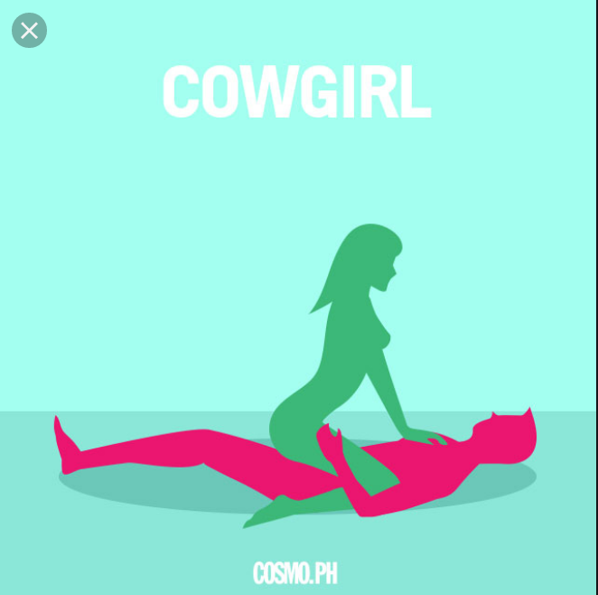
```
*cosmopolitan information*

*you had the idea of putting your nails on my belly*

*then the look*

*and after you kiss me, hug me, I breath hiding my tears of pain, and I think we relaxed*
</div>

--- *okay*
*i remember*

It felt good to sexualize the conversation and remember the anecdote together. It seemed we were connecting again.

<div style="text-align: right">
--- `r emo::ji("slightly_smiling_face")`

*I don't know if it will go away eventually*

*but it is a bit like India*

*It is a hard drug*

*Anyway*

*what I said*

*It would be good to talk/see/spend time with you*

*I don't know how you feel about me, or what your thoughts about me are/were before/after my letter*

*and I don't know how being on the school is changing you*

[*I don't know anything*](https://youtu.be/l17lZ2T-zWE?t=3366)

*You are good at putting me on this state of surrender*

*you expand me by contracting me*

*daostic paradoxes*

`r emo::ji("blush")`
</div>


--- `r emo::ji("+1")`

*the letter was quite boring to read*

That caught me unwarded, but I actually laugh at your straightforwardness and carelessness. Also, it remind me of our lovingly hostile relationship.

<div style="text-align: right">
--- *hahahahaah*

*thank you for the feedback*
</div>

--- *but im glad u wrote it, probably in 10 years i will be appreciating it much more*

<div style="text-align: right">
--- `r emo::ji("+1")`

*It is nice that you think with perspective*

</div>

--- `r emo::ji("+1")`

<div style="text-align: right">
--- `r emo::ji("+1")`
</div>

--- `r emo::ji("+1")`

The conversation was becoming pointless. But, I was feeling quite confident of myself and my writings and texts, since I was receiving positive feedback quite frequently these days.

<div style="text-align: right">
--- `r emo::ji("+1")`

*historians are going to have a hard time deciphering these thumbs*

*About my artistic creations, I already assumed that you are not my audience niche*

*lucky me other people think differently*
</div>

--- *poor people tho*

<div style="text-align: right">
--- *we don't know*

*do you want the link of my video again?*

*I like this process: challenge, surprise, vulnerability, worry and finally caring, or love*

*I would like to see how many of your actors can go through it*

*and how many victims do you need to switch methodology*
</div>

I was mainly thinking about you being an artistic director and destroy progressively the psyches of your cast. But you seemed to have something different on mind.
 
--- *This is just a game*

<div style="text-align: right">
--- *I know*
</div>

I didn’t

<div style="text-align: right">
--- *tomorrow I will try some "[spiritual medicines](https://www.youtube.com/watch?v=_UV7FBF0YZs)"*

*universe is pulling*
</div>

It was. 

Next day (2019-09-20), I tried kambó, rape, and bufotenine. The bufo was great. It possessed me fully. I entered in contact with an inner happy beast that roared and laughed at its own blissful aliveness. I wanted to share some of my experience with you, and I sent you a picture of the burns from the kambó.

<div style="text-align: right">
```{r bufo, fig.margin = TRUE, out.width = "25%", fig.align='right', echo=FALSE}
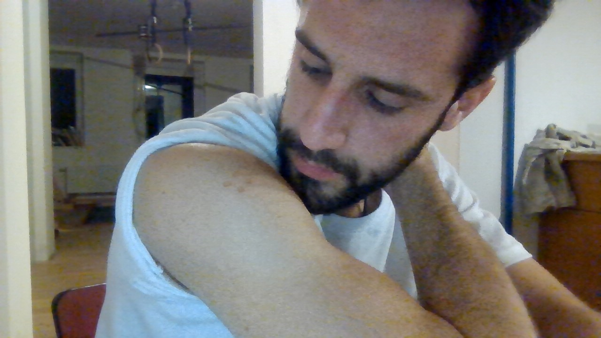
```
--- *I can send you the boring video that I filmed today with my performance*

[*https://en.wikipedia.org/wiki/Bufotenin*](https://en.wikipedia.org/wiki/Bufotenin)

*I can send you the boring video that I filmed today with my performance*

*Not send you, but show you*^[Special gift to you, my reader. [Enjoy my dive]( https://photos.app.goo.gl/Juu8MUzjWfTHwEVVA) ]

*when we meet in Estonia* `r emo::ji("blush")`

*I watched your trailer again...* 

*25 October^[The release date of the documentary]...* 

*Actually, I would be okay with being there while it happens.* 

*I am okay with your short time/attention to me.*

*I will enjoy myself meanwhile*

</div>

Somehow, although, I was trying to bring up the topic of my visit to Estonia, you were not very responding. My head was still spinning for the substances I had taken. But I felt connected with myself, more confident, and more alive. I didn’t realize until Sunday that I had missed an appointment at the university for taking the medicines. My advisor emailed me in a serious tone. I was getting unconsciously distracted and distant from those responsibilities that I wanted to take out of my life, but I didn’t know how to do it.

I was about becoming 27 and my life was getting messy


### Astrological match (2019-09-23 to 2019-09-25)

