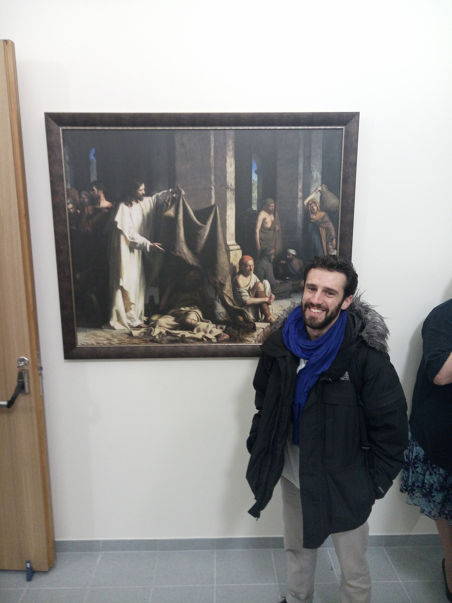

--- 
title: "Spiritual touch. A journey to the depths of being."
author: "Carlos Alcala a.k.a. Carlito Fluito"
date: "`r Sys.Date()`"
site: bookdown::bookdown_site
documentclass: book
bibliography: 
biblio-style: apalike
link-citations: yes
github-repo: carlitofluito/A
description: "Divided into four books."
---
# Prelude

## Sunday, 27 of October of 2019

Fotografiska Restaurant, Telliskivi Loomelinnak, Tallinn, Estonia

14.35

Such a trip, brother. Such a trip. 

So many things have happened that it is difficult to know where to start… Such a cliché, isn’t it?

I am more connected to my friends now, more connected to myself, more connected to the world, more connected to the universe, more connected to life. 

I used to feel lonely, questioning what I was doing and towards where I was going. I used to feel purposeless, I used to be in dark places, living dark lives. I have seen a life now that I want to follow. I have seen a place that fills me with life and good energy. I am in a mood that resonates with who I am.

I was in contact with my shadow yesterday. I was ready to witness and participate in death, in violence, in killing, in pain, in suffering, in committing horrendous deeds. I was ready for it. 

Now, I am ready for something else. 


```{r jesus, fig.margin = TRUE, out.width = "75%", fig.align='center', echo=FALSE}

```